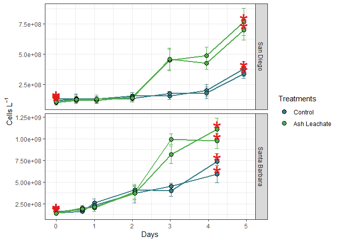
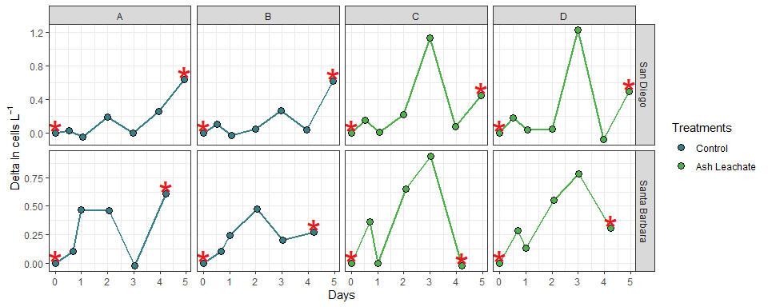

ACICC experiment bacterial abundance
================
Lexie Christopoulos
10/29/2020

\#Intro This document shows how **individual bottle** bacterial
abundance data from ACIDD experiments were processed, QD’d, and
analyzed.

``` r
library(tidyverse)
library(readxl)
library(lubridate)
```

\#Import Data

``` r
excel_sheets("C:/Users/aechr/Desktop/github/144l_students/Input_Data/week3/ACIDD_Exp_BactAbund.xlsx")
```

    ## [1] "Metadata" "Data"

``` r
metadata <- read_excel("C:/Users/aechr/Desktop/github/144l_students/Input_Data/week3/ACIDD_Exp_BactAbund.xlsx", sheet = "Metadata")
glimpse(metadata)
```

    ## Rows: 84
    ## Columns: 18
    ## $ Experiment              <chr> "ASH171", "ASH171", "ASH171", "ASH171", "AS...
    ## $ Location                <chr> "San Diego", "San Diego", "San Diego", "San...
    ## $ Temperature_C           <dbl> 15, 15, 15, 15, 15, 15, 15, 15, 15, 15, 15,...
    ## $ Depth                   <dbl> 5, 5, 5, 5, 5, 5, 5, 5, 5, 5, 5, 5, 5, 5, 5...
    ## $ Bottle                  <chr> "A", "A", "A", "A", "A", "A", "A", "A", "A"...
    ## $ Timepoint               <dbl> 0, 1, 2, 3, 4, 5, 6, 7, 8, 9, 10, 0, 1, 2, ...
    ## $ Treatment               <chr> "Control", "Control", "Control", "Control",...
    ## $ Target_DOC_Amendment_uM <dbl> 0, 0, 0, 0, 0, 0, 0, 0, 0, 0, 0, 0, 0, 0, 0...
    ## $ Inoculum_L              <dbl> 1.5, 1.5, 1.5, 1.5, 1.5, 1.5, 1.5, 1.5, 1.5...
    ## $ Media_L                 <dbl> 4, 4, 4, 4, 4, 4, 4, 4, 4, 4, 4, 4, 4, 4, 4...
    ## $ Datetime                <chr> "2017-12-16T21:30", "2017-12-17T10:00", "20...
    ## $ TOC_Sample              <lgl> TRUE, FALSE, FALSE, FALSE, FALSE, FALSE, FA...
    ## $ DOC_Sample              <lgl> TRUE, TRUE, FALSE, TRUE, FALSE, FALSE, FALS...
    ## $ Parallel_Sample         <lgl> TRUE, FALSE, FALSE, FALSE, FALSE, FALSE, FA...
    ## $ Cell_Sample             <lgl> TRUE, TRUE, TRUE, TRUE, TRUE, TRUE, TRUE, F...
    ## $ DNA_Sample              <lgl> TRUE, FALSE, FALSE, FALSE, FALSE, FALSE, TR...
    ## $ Nutrient_Sample         <lgl> TRUE, FALSE, FALSE, FALSE, FALSE, FALSE, TR...
    ## $ DNA_SampleID            <chr> "ASH171-A0_S293", NA, NA, NA, NA, NA, "ASH1...

``` r
#unique(metadata$Experiment)
#unique(metadata$Location)
#unique(metadata$Bottle)
#unique(metadata$Treatment)

data <- read_excel("C:/Users/aechr/Desktop/github/144l_students/Input_Data/week3/ACIDD_Exp_BactAbund.xlsx", sheet = "Data")
glimpse(data)
```

    ## Rows: 52
    ## Columns: 5
    ## $ Experiment  <chr> "ASH171", "ASH171", "ASH171", "ASH171", "ASH171", "ASH1...
    ## $ Bottle      <chr> "A", "A", "A", "A", "A", "A", "A", "B", "B", "B", "B", ...
    ## $ Timepoint   <dbl> 0, 1, 2, 3, 4, 5, 6, 0, 1, 2, 3, 4, 5, 6, 0, 1, 2, 3, 4...
    ## $ Cells_ml    <dbl> 130000, 134000, 128000, 155000, 155000, 200000, 377000,...
    ## $ Cells_ml_sd <dbl> 20900, 27600, 22200, 25200, 31900, 49100, 59700, 18400,...

``` r
joined <- left_join(metadata, data)
```

    ## Joining, by = c("Experiment", "Bottle", "Timepoint")

``` r
#names(joined)
#summary(joined)
glimpse(joined)
```

    ## Rows: 84
    ## Columns: 20
    ## $ Experiment              <chr> "ASH171", "ASH171", "ASH171", "ASH171", "AS...
    ## $ Location                <chr> "San Diego", "San Diego", "San Diego", "San...
    ## $ Temperature_C           <dbl> 15, 15, 15, 15, 15, 15, 15, 15, 15, 15, 15,...
    ## $ Depth                   <dbl> 5, 5, 5, 5, 5, 5, 5, 5, 5, 5, 5, 5, 5, 5, 5...
    ## $ Bottle                  <chr> "A", "A", "A", "A", "A", "A", "A", "A", "A"...
    ## $ Timepoint               <dbl> 0, 1, 2, 3, 4, 5, 6, 7, 8, 9, 10, 0, 1, 2, ...
    ## $ Treatment               <chr> "Control", "Control", "Control", "Control",...
    ## $ Target_DOC_Amendment_uM <dbl> 0, 0, 0, 0, 0, 0, 0, 0, 0, 0, 0, 0, 0, 0, 0...
    ## $ Inoculum_L              <dbl> 1.5, 1.5, 1.5, 1.5, 1.5, 1.5, 1.5, 1.5, 1.5...
    ## $ Media_L                 <dbl> 4, 4, 4, 4, 4, 4, 4, 4, 4, 4, 4, 4, 4, 4, 4...
    ## $ Datetime                <chr> "2017-12-16T21:30", "2017-12-17T10:00", "20...
    ## $ TOC_Sample              <lgl> TRUE, FALSE, FALSE, FALSE, FALSE, FALSE, FA...
    ## $ DOC_Sample              <lgl> TRUE, TRUE, FALSE, TRUE, FALSE, FALSE, FALS...
    ## $ Parallel_Sample         <lgl> TRUE, FALSE, FALSE, FALSE, FALSE, FALSE, FA...
    ## $ Cell_Sample             <lgl> TRUE, TRUE, TRUE, TRUE, TRUE, TRUE, TRUE, F...
    ## $ DNA_Sample              <lgl> TRUE, FALSE, FALSE, FALSE, FALSE, FALSE, TR...
    ## $ Nutrient_Sample         <lgl> TRUE, FALSE, FALSE, FALSE, FALSE, FALSE, TR...
    ## $ DNA_SampleID            <chr> "ASH171-A0_S293", NA, NA, NA, NA, NA, "ASH1...
    ## $ Cells_ml                <dbl> 130000, 134000, 128000, 155000, 155000, 200...
    ## $ Cells_ml_sd             <dbl> 20900, 27600, 22200, 25200, 31900, 49100, 5...

# Prepare Data

Convert data and time column values from characters to dates, add
columns with time elapsed for each experiment, convert cells/mL to
cells/L, and subset data to select only VOI and drop NA’s.

``` r
cells <- joined %>% 
  mutate(Datetime = ymd_hm(Datetime), cells = Cells_ml * 1000, sd_cells = Cells_ml_sd * 1000) %>% 
  group_by(Experiment, Treatment, Bottle) %>% 
  mutate(interv = interval(first(Datetime), Datetime), hours = interv/3600, days = hours/24) %>% 
  ungroup() %>% 
  select(Experiment:Nutrient_Sample, hours, days, cells, sd_cells) %>% 
  drop_na(cells)

#glimpse(cells) 
```

\#Plot Growth Curves

``` r
custom.colors <- c("Control" = "#377E88", "Ash Leachate" = "#4DAF4A", "Santa Barabara" = "#E41A1C", "San Diego" = "#FF7F00")
levels <- c("Control", "Ash Leachate", "San Diego", "Santa Barbara")

cells %>%
  mutate(dna = ifelse(DNA_Sample == T, "*", NA)) %>% 
  ggplot(aes(x = days, y = cells, group = interaction(Experiment, Treatment, Bottle)))+
  geom_errorbar(aes(ymin = cells - sd_cells, ymax = cells + sd_cells, color = factor(Treatment, levels = levels)), width = 0.1)+
  geom_line(aes(color = factor(Treatment, levels = levels)), size = 1)+
  geom_point(aes(fill = factor(Treatment, levels = levels)), size = 3, color = "black", shape = 21)+
  geom_text(aes(label = dna), size = 12, color = "#E41A1C")+
  labs(x = "Days", y = expression(paste("Cells L"^-1)),fill = "Treatments")+
  guides(color = FALSE)+
  scale_color_manual(values = custom.colors)+
  scale_fill_manual(values = custom.colors)+
  facet_grid(rows = "Location", scales = "free")+
  theme_bw()
```

    ## Warning: Removed 36 rows containing missing values (geom_text).

<!-- -->

We can calculate: - The total change in cells from the initail condition
to the end of the experiment - Specific growth rates as the slope of
ln(abundance) v time during the exponential growth phase - Doubling time
as ln(2) divided by the specific growth rate - The mean of each of these
parameters for each treatment

First, we’ll need to determine where exponential growth occurs in each
of the experiments, if it does. So let’s plot ln(abundance) v time.

\#Identify exponential phase of growth

**NOTE about logarithms in R**

log(x) gives the natural log of x, not log base 10 log10(x) gives the
log base 10 log2(x) gives log base 2

``` r
ln_cells <- cells %>% 
  group_by(Experiment, Treatment, Bottle) %>% 
  mutate(ln_cells = log(cells), diff_ln_cells = ln_cells - lag(ln_cells, default = first(ln_cells))) %>% 
  ungroup()
```

``` r
ln_cells %>%
  mutate(dna = ifelse(DNA_Sample == T, "*", NA)) %>% 
  ggplot(aes(x = days, y = diff_ln_cells, group = interaction(Experiment, Treatment, Bottle)))+
  geom_line(aes(color = factor(Treatment, levels = levels)), size = 1)+
  geom_point(aes(fill = factor(Treatment, levels = levels)), size = 3, color = "black", shape = 21)+
  geom_text(aes(label = dna), size = 12, color = "#E41A1C")+
  labs(x = "Days", y = expression(paste( "Delta ln cells L"^-1)),fill = "Treatments")+
  guides(color = FALSE)+
  scale_color_manual(values = custom.colors)+
  scale_fill_manual(values = custom.colors)+
  facet_grid(Location~Bottle, scales = "free")+
  theme_bw()
```

    ## Warning: Removed 36 rows containing missing values (geom_text).

<!-- -->

This plot makes it a little easier to see, with the data that we have,
where exponential growth occurs for each bottle:

\-SD Bottle A \~3-5 d (T4-T6) -SD Bottle B \~4-5 d (T5-T6) -SD Bottle C
\~2-3 d (T3-T4) -SD Bottle D \~2-3 d (T3-T4)

\-SB Bottle A \~0.5-1 d (T1-T2) -SB Bottle B \~0.5-2 d (T1-T3) -SB
Bottle C \~1-3 d (T2-T4) -SB Bottle D \~1-3 d (T2-T4)

\#Calculating growth rates, doubling times, and Delta cell abundances

``` r
growth <- ln_cells %>% 
  mutate(exp_start = ifelse(Experiment == "ASH171" & Bottle == "A", 4, NA),
         exp_start = ifelse(Experiment == "ASH171" & Bottle == "B", 5, exp_start),
         exp_start = ifelse(Experiment == "ASH171" & Bottle %in% c("C", "D"), 3, exp_start),
         exp_start = ifelse(Experiment == "ASH172" & Bottle %in% c("A", "B"), 1, exp_start), 
         exp_start = ifelse(Experiment == "ASH172" & Bottle %in% c("C", "D"), 2, exp_start),
         exp_end = ifelse(Experiment == "ASH171" & Bottle %in% c( "A", "B"), 6,4),
         exp_end = ifelse(Experiment == "ASH172" & Bottle == "A", 2, exp_end),
         exp_end = ifelse(Experiment == "ASH172" & Bottle == "B", 3, exp_end)) %>% 
  group_by(Experiment, Treatment, Bottle) %>% 
  mutate(ln_cells_exp_start = ifelse(Timepoint == exp_start, ln_cells, NA),
         ln_cells_exp_end = ifelse(Timepoint == exp_end, ln_cells, NA),
         cells_exp_start = ifelse(Timepoint == exp_start, cells, NA),
         cells_exp_end = ifelse(Timepoint == exp_end, cells, NA),
         days_exp_start = ifelse(Timepoint == exp_start, days, NA), 
         days_exp_end = ifelse(Timepoint == exp_end, days, NA)) %>% 
  fill(ln_cells_exp_start:days_exp_end, .direction = "updown") %>% 
  mutate(mew = (ln_cells_exp_end - ln_cells_exp_start)/(days_exp_end - days_exp_start), 
         doubling = log(2)/mew,
         delta_cells = cells_exp_end, first(cells)) %>% 
  ungroup()
```

\#Convert bacterial abundance and change in bacterial abundance to
carbon units

Apply a carbon conversion factor (CCF) to bacterial abundance (Cells
L^-1) to bacterial carbon (\(\mu\) C L^-1)
