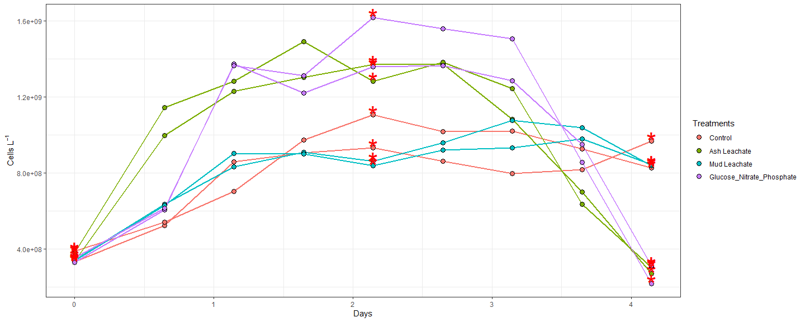
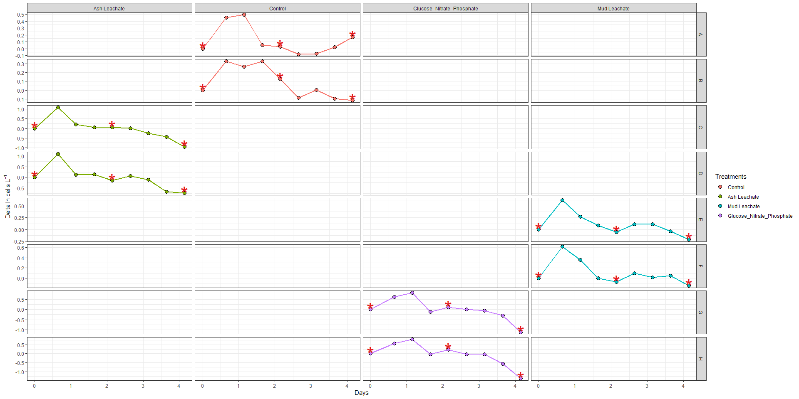
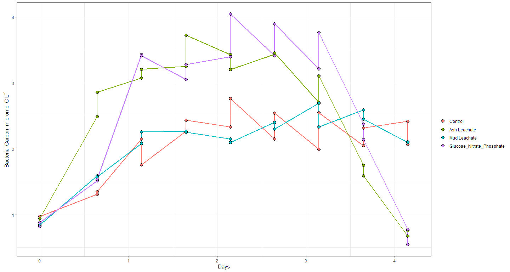
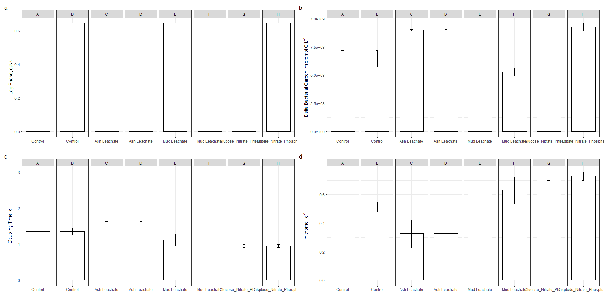

Bacterial Abundance Week 3 Coding
================
Lexie Christopoulos
10/30/2020

\#Intro

This document attempts to analyze and interpret the data regarding
*individual bottle* bacterial abundance data as found in the 2018
Bacterial Abundance dataset.

``` r
library(tidyverse)
library(readxl)
library(lubridate)
library(patchwork)
library(praise)
```

\#Import Data

``` r
excel_sheets("C:/Users/aechr/Desktop/github/144l_students/Input_Data/week3/144L_2018_BactAbund.xlsx")
```

    ## [1] "Metadata" "Data"

``` r
metadata <- read_excel("C:/Users/aechr/Desktop/github/144l_students/Input_Data/week3/144L_2018_BactAbund.xlsx", sheet = "Metadata")
glimpse(metadata)
```

    ## Rows: 80
    ## Columns: 16
    ## $ Experiment           <chr> "144L_2018", "144L_2018", "144L_2018", "144L_2...
    ## $ Location             <chr> "Campus Point", "Campus Point", "Campus Point"...
    ## $ Temperature          <dbl> 20, 20, 20, 20, 20, 20, 20, 20, 20, 20, 20, 20...
    ## $ Depth                <dbl> 1, 1, 1, 1, 1, 1, 1, 1, 1, 1, 1, 1, 1, 1, 1, 1...
    ## $ Bottle               <chr> "A", "A", "A", "A", "A", "A", "A", "A", "A", "...
    ## $ Timepoint            <dbl> 0, 1, 2, 3, 4, 5, 6, 7, 8, 9, 0, 1, 2, 3, 4, 5...
    ## $ Treatment            <chr> "Control", "Control", "Control", "Control", "C...
    ## $ Target_DOC_Amendment <dbl> 0, 0, 0, 0, 0, 0, 0, 0, 0, 0, 0, 0, 0, 0, 0, 0...
    ## $ Inoculum_L           <dbl> 1.5, 1.5, 1.5, 1.5, 1.5, 1.5, 1.5, 1.5, 1.5, 1...
    ## $ Media_L              <dbl> 3.5, 3.5, 3.5, 3.5, 3.5, 3.5, 3.5, 3.5, 3.5, 3...
    ## $ Datetime             <chr> "2018-10-15T16:30", "2018-10-16T08:00", "2018-...
    ## $ TOC_Sample           <lgl> TRUE, FALSE, FALSE, FALSE, TRUE, FALSE, FALSE,...
    ## $ Parallel_Sample      <lgl> TRUE, FALSE, FALSE, FALSE, TRUE, FALSE, FALSE,...
    ## $ Cell_Sample          <lgl> TRUE, TRUE, TRUE, TRUE, TRUE, TRUE, TRUE, TRUE...
    ## $ DNA_Sample           <lgl> TRUE, FALSE, FALSE, FALSE, TRUE, FALSE, FALSE,...
    ## $ DNA_SampleID         <chr> "144_A0_S6", NA, NA, NA, "144_A4_S7", NA, NA, ...

``` r
#unique(metadata$Experiment) only 1 experiment  
#unique(metadata$Location) only 1 location, Campus Point 
#unique(metadata$Bottle) 8 bottles, A - H
#unique(metadata$Treatment) 4 treatments, Control, Ash Leachate, Mud Leachate, and Glucose_Nitrate, Phosphate 

data <- read_excel("C:/Users/aechr/Desktop/github/144l_students/Input_Data/week3/144L_2018_BactAbund.xlsx", sheet = "Data")
glimpse(data)
```

    ## Rows: 72
    ## Columns: 3
    ## $ Bottle    <chr> "A", "A", "A", "A", "A", "A", "A", "A", "A", "B", "B", "B...
    ## $ Timepoint <dbl> 0, 1, 2, 3, 4, 5, 6, 7, 8, 0, 1, 2, 3, 4, 5, 6, 7, 8, 0, ...
    ## $ Cells_ml  <dbl> 332531.5, 523943.1, 859019.9, 906998.9, 933025.2, 861129....

``` r
joined <- left_join(metadata, data)
```

    ## Joining, by = c("Bottle", "Timepoint")

``` r
glimpse(joined)
```

    ## Rows: 80
    ## Columns: 17
    ## $ Experiment           <chr> "144L_2018", "144L_2018", "144L_2018", "144L_2...
    ## $ Location             <chr> "Campus Point", "Campus Point", "Campus Point"...
    ## $ Temperature          <dbl> 20, 20, 20, 20, 20, 20, 20, 20, 20, 20, 20, 20...
    ## $ Depth                <dbl> 1, 1, 1, 1, 1, 1, 1, 1, 1, 1, 1, 1, 1, 1, 1, 1...
    ## $ Bottle               <chr> "A", "A", "A", "A", "A", "A", "A", "A", "A", "...
    ## $ Timepoint            <dbl> 0, 1, 2, 3, 4, 5, 6, 7, 8, 9, 0, 1, 2, 3, 4, 5...
    ## $ Treatment            <chr> "Control", "Control", "Control", "Control", "C...
    ## $ Target_DOC_Amendment <dbl> 0, 0, 0, 0, 0, 0, 0, 0, 0, 0, 0, 0, 0, 0, 0, 0...
    ## $ Inoculum_L           <dbl> 1.5, 1.5, 1.5, 1.5, 1.5, 1.5, 1.5, 1.5, 1.5, 1...
    ## $ Media_L              <dbl> 3.5, 3.5, 3.5, 3.5, 3.5, 3.5, 3.5, 3.5, 3.5, 3...
    ## $ Datetime             <chr> "2018-10-15T16:30", "2018-10-16T08:00", "2018-...
    ## $ TOC_Sample           <lgl> TRUE, FALSE, FALSE, FALSE, TRUE, FALSE, FALSE,...
    ## $ Parallel_Sample      <lgl> TRUE, FALSE, FALSE, FALSE, TRUE, FALSE, FALSE,...
    ## $ Cell_Sample          <lgl> TRUE, TRUE, TRUE, TRUE, TRUE, TRUE, TRUE, TRUE...
    ## $ DNA_Sample           <lgl> TRUE, FALSE, FALSE, FALSE, TRUE, FALSE, FALSE,...
    ## $ DNA_SampleID         <chr> "144_A0_S6", NA, NA, NA, "144_A4_S7", NA, NA, ...
    ## $ Cells_ml             <dbl> 332531.5, 523943.1, 859019.9, 906998.9, 933025...

\#Prepare Data

Convert data and time column values from characters to dates, add
columns with time elapsed for each experiment, convert cells/mL to
cells/L, and subset data to select only VOI and drop NA’s.

``` r
cells <- joined %>%
   mutate(Datetime = ymd_hm(Datetime), cells = Cells_ml * 1000) %>%
  group_by(Experiment, Treatment, Bottle) %>% 
  mutate(interv = interval(first(Datetime), Datetime), hours = interv/3600, days = hours/24) %>% 
  ungroup() %>% 
  select(Experiment, Location, Bottle:Treatment, Datetime, DNA_Sample, cells, hours, days) %>% 
  drop_na(cells)
```

\#Plot Growth Curves

``` r
levels <- c("Control", "Ash Leachate", "Mud Leachate", "Glucose_Nitrate_Phosphate", "Campus Point")

cells %>%
  mutate(dna = ifelse(DNA_Sample == T, "*", NA)) %>% 
  ggplot(aes(x = days, y = cells, group = interaction(Experiment, Treatment, Bottle)))+
  geom_line(aes(color = factor(Treatment, levels = levels)), size = 1)+
  geom_point(aes(fill = factor(Treatment, levels = levels)), size = 3, color = "black", shape = 21)+
  geom_text(aes(label = dna), size = 12, color = "red")+
  labs(x = "Days", y = expression(paste("Cells L"^-1)),fill = "Treatments")+
  guides(color = FALSE)+
  theme_bw()
```

    ## Warning: Removed 48 rows containing missing values (geom_text).

<!-- -->

With these growth curves and the subsetted data, we can calculate: - The
total change in cells from the initail condition to the end of the
experiment - Specific growth rates as the slope of ln(abundance) v time
during the exponential growth phase - Doubling time as ln(2) divided by
the specific growth rate - The mean of each of these parameters for each
treatment

First, we’ll need to determine where exponential growth occurs in the
experiments, if it does. So let’s plot ln(abundance) v time.

\#Identify exponetial growth

``` r
ln_cells <- cells %>% 
  group_by(Treatment, Bottle) %>% 
  mutate(ln_cells = log(cells), diff_ln_cells = ln_cells - lag(ln_cells, default = first(ln_cells))) %>% 
  ungroup()
```

``` r
ln_cells %>%
  mutate(dna = ifelse(DNA_Sample == T, "*", NA)) %>% 
  ggplot(aes(x = days, y = diff_ln_cells, group = interaction(Treatment, Bottle)))+
  geom_line(aes(color = factor(Treatment, levels = levels)), size = 1)+
  geom_point(aes(fill = factor(Treatment, levels = levels)), size = 3, color = "black", shape = 21)+
  geom_text(aes(label = dna), size = 12, color = "#E41A1C")+
  labs(x = "Days", y = expression(paste( "Delta ln cells L"^-1)),fill = "Treatments")+
  guides(color = FALSE)+
  facet_grid(Bottle~Treatment, scales = "free")+
  theme_bw()
```

    ## Warning: Removed 48 rows containing missing values (geom_text).

<!-- -->

This plot makes it a little easier to see, with the data that we have,
where exponential growth occurs for each bottle:

Ash Leachate: - Bottle C \~0.5-1 d (T1-T2) - Bottle D \~0.5-1 d (T1-T2)

Control: - Bottle A \~0.5-1.5 d (T1-T3) - Bottle B \~0.5-2 d (T1-4)

Glucose\_Nitrate\_Phosphate: -Bottle G \~0-1.5 d (T1-T3) -Bottle H
\~0-1.5 d (T1-T3)

Mud Leachate: -Bottle E \~0.5-1 d (T1-T2) \_Bottle F \~0.5-1 d (T1-T2)

\#Calculating Growth rates, doubling times, and delta cell abundance.

``` r
growth <- ln_cells %>% 
mutate(exp_start = ifelse(Treatment == "Ash Leachate" & Bottle %in% c( "C", "D"), 1, NA), 
       exp_start = ifelse(Treatment == "Control" & Bottle %in% c("A", "B"), 1, exp_start),
       exp_start = ifelse(Treatment == "Glucose_Nitrate_Phosphate" & Bottle %in% c("G", "H"), 1, exp_start),
       exp_start = ifelse(Treatment == "Mud Leachate" & Bottle %in% c("E", "F"), 1, exp_start),
       exp_end = ifelse(Treatment == "Ash Leachate" & Bottle %in% c("C", "D"), 2, NA),
       exp_end = ifelse(Treatment == "Control" & Bottle == "A", 3, exp_end), 
       exp_end = ifelse(Treatment == "Control" & Bottle == "B", 4, exp_end), 
       exp_end = ifelse(Treatment == "Glucose_Nitrate_Phosphate" & Bottle %in% c( "G", "H"), 3, exp_end),
       exp_end = ifelse(Treatment == "Mud Leachate" & Bottle %in% c("E", "F"), 2, exp_end)) %>% 
   group_by(Treatment, Bottle) %>% 
  mutate(ln_cells_exp_start = ifelse(Timepoint == exp_start, ln_cells, NA),
         ln_cells_exp_end = ifelse(Timepoint == exp_end, ln_cells, NA),
         cells_exp_start = ifelse(Timepoint == exp_start, cells, NA),
         cells_exp_end = ifelse(Timepoint == exp_end, cells, NA),
         days_exp_start = ifelse(Timepoint == exp_start, days, NA), 
         days_exp_end = ifelse(Timepoint == exp_end, days, NA)) %>% 
  fill(ln_cells_exp_start:days_exp_end, .direction = "updown") %>% 
  mutate(mew = (ln_cells_exp_end - ln_cells_exp_start)/(days_exp_end - days_exp_start), 
         doubling = log(2)/mew,
         delta_cells = cells_exp_end - first(cells)) %>% 
  ungroup()
```

\#Convert bacterial abundance and change in bacterial abundance to
carbon units

Apply a carbon conversion factor (CCF) to bacterial abundance (Cells
L<sup>-1</sup>) to bacterial carbon (micromol C L<sup>-1</sup>)

We’ll apply the average carbon content of bacterioplankton cells from
Coastal Japan (\~ 30 fg C cell<sup>-1</sup>). This CCF was used in
previous experiments conducted in the SBC.

``` r
bactcarbon <- growth %>% 
  mutate(bc = cells * (2.5 * 10^-9), 
         delta_bc = delta_cells * (2.5 * 10^-9))
glimpse(bactcarbon)
```

    ## Rows: 72
    ## Columns: 25
    ## $ Experiment         <chr> "144L_2018", "144L_2018", "144L_2018", "144L_201...
    ## $ Location           <chr> "Campus Point", "Campus Point", "Campus Point", ...
    ## $ Bottle             <chr> "A", "A", "A", "A", "A", "A", "A", "A", "A", "B"...
    ## $ Timepoint          <dbl> 0, 1, 2, 3, 4, 5, 6, 7, 8, 0, 1, 2, 3, 4, 5, 6, ...
    ## $ Treatment          <chr> "Control", "Control", "Control", "Control", "Con...
    ## $ Datetime           <dttm> 2018-10-15 16:30:00, 2018-10-16 08:00:00, 2018-...
    ## $ DNA_Sample         <lgl> TRUE, FALSE, FALSE, FALSE, TRUE, FALSE, FALSE, F...
    ## $ cells              <dbl> 332531522, 523943125, 859019934, 906998856, 9330...
    ## $ hours              <Interval> 2018-10-15 16:30:00 UTC--2018-10-15 16:30:0...
    ## $ days               <Interval> 2018-10-15 16:30:00 UTC--2018-10-15 16:30:0...
    ## $ ln_cells           <dbl> 19.62225, 20.07689, 20.57130, 20.62565, 20.65394...
    ## $ diff_ln_cells      <dbl> 0.000000000, 0.454648479, 0.494408990, 0.0543490...
    ## $ exp_start          <dbl> 1, 1, 1, 1, 1, 1, 1, 1, 1, 1, 1, 1, 1, 1, 1, 1, ...
    ## $ exp_end            <dbl> 3, 3, 3, 3, 3, 3, 3, 3, 3, 4, 4, 4, 4, 4, 4, 4, ...
    ## $ ln_cells_exp_start <dbl> 20.07689, 20.07689, 20.07689, 20.07689, 20.07689...
    ## $ ln_cells_exp_end   <dbl> 20.62565, 20.62565, 20.62565, 20.62565, 20.62565...
    ## $ cells_exp_start    <dbl> 523943125, 523943125, 523943125, 523943125, 5239...
    ## $ cells_exp_end      <dbl> 906998856, 906998856, 906998856, 906998856, 9069...
    ## $ days_exp_start     <dbl> 0.6458333, 0.6458333, 0.6458333, 0.6458333, 0.64...
    ## $ days_exp_end       <dbl> 1.645833, 1.645833, 1.645833, 1.645833, 1.645833...
    ## $ mew                <dbl> 0.5487581, 0.5487581, 0.5487581, 0.5487581, 0.54...
    ## $ doubling           <dbl> 1.263120, 1.263120, 1.263120, 1.263120, 1.263120...
    ## $ delta_cells        <dbl> 574467334, 574467334, 574467334, 574467334, 5744...
    ## $ bc                 <dbl> 0.8313288, 1.3098578, 2.1475498, 2.2674971, 2.33...
    ## $ delta_bc           <dbl> 1.436168, 1.436168, 1.436168, 1.436168, 1.436168...

\#Calculate Treatment Averages

``` r
averages <- bactcarbon %>% 
  group_by(Bottle, Treatment, Timepoint) %>% 
  mutate(ave_bc = mean(bc), sd_bc = sd(bc)) %>% 
  ungroup() %>% 
  group_by(Experiment, Treatment) %>% 
  mutate(ave_mew = mean(mew), 
         sd_mew = sd(mew), 
         ave_doubling = mean(doubling),
         sd_doubling = sd(doubling),
         ave_delta_cells = mean(delta_cells),
         sd_delta_cells = sd(delta_cells), 
         ave_lag = mean(days_exp_start),
         sd_lag = sd(days_exp_start)) %>% 
  ungroup()

glimpse(averages)
```

    ## Rows: 72
    ## Columns: 35
    ## $ Experiment         <chr> "144L_2018", "144L_2018", "144L_2018", "144L_201...
    ## $ Location           <chr> "Campus Point", "Campus Point", "Campus Point", ...
    ## $ Bottle             <chr> "A", "A", "A", "A", "A", "A", "A", "A", "A", "B"...
    ## $ Timepoint          <dbl> 0, 1, 2, 3, 4, 5, 6, 7, 8, 0, 1, 2, 3, 4, 5, 6, ...
    ## $ Treatment          <chr> "Control", "Control", "Control", "Control", "Con...
    ## $ Datetime           <dttm> 2018-10-15 16:30:00, 2018-10-16 08:00:00, 2018-...
    ## $ DNA_Sample         <lgl> TRUE, FALSE, FALSE, FALSE, TRUE, FALSE, FALSE, F...
    ## $ cells              <dbl> 332531522, 523943125, 859019934, 906998856, 9330...
    ## $ hours              <Interval> 2018-10-15 16:30:00 UTC--2018-10-15 16:30:0...
    ## $ days               <Interval> 2018-10-15 16:30:00 UTC--2018-10-15 16:30:0...
    ## $ ln_cells           <dbl> 19.62225, 20.07689, 20.57130, 20.62565, 20.65394...
    ## $ diff_ln_cells      <dbl> 0.000000000, 0.454648479, 0.494408990, 0.0543490...
    ## $ exp_start          <dbl> 1, 1, 1, 1, 1, 1, 1, 1, 1, 1, 1, 1, 1, 1, 1, 1, ...
    ## $ exp_end            <dbl> 3, 3, 3, 3, 3, 3, 3, 3, 3, 4, 4, 4, 4, 4, 4, 4, ...
    ## $ ln_cells_exp_start <dbl> 20.07689, 20.07689, 20.07689, 20.07689, 20.07689...
    ## $ ln_cells_exp_end   <dbl> 20.62565, 20.62565, 20.62565, 20.62565, 20.62565...
    ## $ cells_exp_start    <dbl> 523943125, 523943125, 523943125, 523943125, 5239...
    ## $ cells_exp_end      <dbl> 906998856, 906998856, 906998856, 906998856, 9069...
    ## $ days_exp_start     <dbl> 0.6458333, 0.6458333, 0.6458333, 0.6458333, 0.64...
    ## $ days_exp_end       <dbl> 1.645833, 1.645833, 1.645833, 1.645833, 1.645833...
    ## $ mew                <dbl> 0.5487581, 0.5487581, 0.5487581, 0.5487581, 0.54...
    ## $ doubling           <dbl> 1.263120, 1.263120, 1.263120, 1.263120, 1.263120...
    ## $ delta_cells        <dbl> 574467334, 574467334, 574467334, 574467334, 5744...
    ## $ bc                 <dbl> 0.8313288, 1.3098578, 2.1475498, 2.2674971, 2.33...
    ## $ delta_bc           <dbl> 1.436168, 1.436168, 1.436168, 1.436168, 1.436168...
    ## $ ave_bc             <dbl> 0.8313288, 1.3098578, 2.1475498, 2.2674971, 2.33...
    ## $ sd_bc              <dbl> NA, NA, NA, NA, NA, NA, NA, NA, NA, NA, NA, NA, ...
    ## $ ave_mew            <dbl> 0.5134006, 0.5134006, 0.5134006, 0.5134006, 0.51...
    ## $ sd_mew             <dbl> 0.03638247, 0.03638247, 0.03638247, 0.03638247, ...
    ## $ ave_doubling       <dbl> 1.356544, 1.356544, 1.356544, 1.356544, 1.356544...
    ## $ sd_doubling        <dbl> 0.09613235, 0.09613235, 0.09613235, 0.09613235, ...
    ## $ ave_delta_cells    <dbl> 645867748, 645867748, 645867748, 645867748, 6458...
    ## $ sd_delta_cells     <dbl> 73470419, 73470419, 73470419, 73470419, 73470419...
    ## $ ave_lag            <dbl> 0.6458333, 0.6458333, 0.6458333, 0.6458333, 0.64...
    ## $ sd_lag             <dbl> 0, 0, 0, 0, 0, 0, 0, 0, 0, 0, 0, 0, 0, 0, 0, 0, ...

\#Plot Treatment Averages

``` r
averages %>% 
  ggplot(aes(x = days, y = ave_bc), group = interaction(Bottle, Treatment))+
  geom_errorbar(aes(ymin = ave_bc - sd_bc, ymax = ave_bc + sd_bc, color = factor(Treatment, levels = levels)), width = 0.1)+
  geom_line(aes(color = factor(Treatment, levels = levels)), size = 1)+
  geom_point(aes(fill = factor(Treatment, levels = levels)), color = "black", shape = 21, size = 3)+
  labs(x = "Days", y = expression("Bacterial Carbon, micromol C L"^-1), fill = "")+
  guides(color = FALSE)+
  theme_bw()
```

<!-- -->

\#\#Barplots

``` r
glimpse(averages)
```

    ## Rows: 72
    ## Columns: 35
    ## $ Experiment         <chr> "144L_2018", "144L_2018", "144L_2018", "144L_201...
    ## $ Location           <chr> "Campus Point", "Campus Point", "Campus Point", ...
    ## $ Bottle             <chr> "A", "A", "A", "A", "A", "A", "A", "A", "A", "B"...
    ## $ Timepoint          <dbl> 0, 1, 2, 3, 4, 5, 6, 7, 8, 0, 1, 2, 3, 4, 5, 6, ...
    ## $ Treatment          <chr> "Control", "Control", "Control", "Control", "Con...
    ## $ Datetime           <dttm> 2018-10-15 16:30:00, 2018-10-16 08:00:00, 2018-...
    ## $ DNA_Sample         <lgl> TRUE, FALSE, FALSE, FALSE, TRUE, FALSE, FALSE, F...
    ## $ cells              <dbl> 332531522, 523943125, 859019934, 906998856, 9330...
    ## $ hours              <Interval> 2018-10-15 16:30:00 UTC--2018-10-15 16:30:0...
    ## $ days               <Interval> 2018-10-15 16:30:00 UTC--2018-10-15 16:30:0...
    ## $ ln_cells           <dbl> 19.62225, 20.07689, 20.57130, 20.62565, 20.65394...
    ## $ diff_ln_cells      <dbl> 0.000000000, 0.454648479, 0.494408990, 0.0543490...
    ## $ exp_start          <dbl> 1, 1, 1, 1, 1, 1, 1, 1, 1, 1, 1, 1, 1, 1, 1, 1, ...
    ## $ exp_end            <dbl> 3, 3, 3, 3, 3, 3, 3, 3, 3, 4, 4, 4, 4, 4, 4, 4, ...
    ## $ ln_cells_exp_start <dbl> 20.07689, 20.07689, 20.07689, 20.07689, 20.07689...
    ## $ ln_cells_exp_end   <dbl> 20.62565, 20.62565, 20.62565, 20.62565, 20.62565...
    ## $ cells_exp_start    <dbl> 523943125, 523943125, 523943125, 523943125, 5239...
    ## $ cells_exp_end      <dbl> 906998856, 906998856, 906998856, 906998856, 9069...
    ## $ days_exp_start     <dbl> 0.6458333, 0.6458333, 0.6458333, 0.6458333, 0.64...
    ## $ days_exp_end       <dbl> 1.645833, 1.645833, 1.645833, 1.645833, 1.645833...
    ## $ mew                <dbl> 0.5487581, 0.5487581, 0.5487581, 0.5487581, 0.54...
    ## $ doubling           <dbl> 1.263120, 1.263120, 1.263120, 1.263120, 1.263120...
    ## $ delta_cells        <dbl> 574467334, 574467334, 574467334, 574467334, 5744...
    ## $ bc                 <dbl> 0.8313288, 1.3098578, 2.1475498, 2.2674971, 2.33...
    ## $ delta_bc           <dbl> 1.436168, 1.436168, 1.436168, 1.436168, 1.436168...
    ## $ ave_bc             <dbl> 0.8313288, 1.3098578, 2.1475498, 2.2674971, 2.33...
    ## $ sd_bc              <dbl> NA, NA, NA, NA, NA, NA, NA, NA, NA, NA, NA, NA, ...
    ## $ ave_mew            <dbl> 0.5134006, 0.5134006, 0.5134006, 0.5134006, 0.51...
    ## $ sd_mew             <dbl> 0.03638247, 0.03638247, 0.03638247, 0.03638247, ...
    ## $ ave_doubling       <dbl> 1.356544, 1.356544, 1.356544, 1.356544, 1.356544...
    ## $ sd_doubling        <dbl> 0.09613235, 0.09613235, 0.09613235, 0.09613235, ...
    ## $ ave_delta_cells    <dbl> 645867748, 645867748, 645867748, 645867748, 6458...
    ## $ sd_delta_cells     <dbl> 73470419, 73470419, 73470419, 73470419, 73470419...
    ## $ ave_lag            <dbl> 0.6458333, 0.6458333, 0.6458333, 0.6458333, 0.64...
    ## $ sd_lag             <dbl> 0, 0, 0, 0, 0, 0, 0, 0, 0, 0, 0, 0, 0, 0, 0, 0, ...

``` r
bar.data <- averages %>% 
  select(Treatment, Bottle, ave_mew:sd_lag) %>% 
  distinct()
```

\#\#\#Mew Data

``` r
mew <- bar.data %>% 
  ggplot(aes(x = factor(Treatment, levels = levels), y = ave_mew), group = interaction(Treatment, Bottle))+
  geom_col(color = "black", fill = "white")+
  geom_errorbar(aes(ymin = ave_mew - sd_mew, ymax = ave_mew + sd_mew), width = 0.1)+
  facet_grid(~factor(Bottle), scales = "free")+
  labs(x = "", y = expression("micromol, d"^-1))+
  theme_bw()
```

\#\#\#Doubling Data

``` r
doubling <- bar.data %>% 
  ggplot(aes(x = factor(Treatment, levels = levels), y = ave_doubling), group = interaction(Treatment, Bottle))+
  geom_col(color = "black", fill = "white")+
  geom_errorbar(aes(ymin = ave_doubling - sd_doubling, ymax = ave_doubling + sd_doubling), width = 0.1)+
  facet_grid(~factor(Bottle), scales = "free")+
  labs(x = "", y = expression("Doubling Time, d"))+
  theme_bw()
```

\#\#\#Delta BC

``` r
delta_bc <- bar.data %>% 
  ggplot(aes(x = factor(Treatment, levels = levels), y = ave_delta_cells), group = interaction(Treatment, Bottle))+
  geom_col(color = "black", fill = "white")+
  geom_errorbar(aes(ymin = ave_delta_cells - sd_delta_cells, ymax = ave_delta_cells + sd_delta_cells), width = 0.1)+
  facet_grid(~factor(Bottle), scales = "free")+
  labs(x = "", y = expression("Delta Bacterial Carbon, micromol C L"^-1))+
  theme_bw()
```

\#\#\#Lag

``` r
lag <- bar.data %>% 
  ggplot(aes(x = factor(Treatment, levels = levels), y = ave_lag), group = interaction(Treatment, Bottle))+
  geom_col(color = "black", fill = "white")+
  geom_errorbar(aes(ymin = ave_lag - sd_lag, ymax = ave_lag + sd_lag), width = 0.1)+
  facet_grid(~factor(Bottle), scales = "free")+
  labs(x = "", y = "Lag Phase, days")+
  theme_bw()
```

``` r
lag + delta_bc + doubling + mew + plot_annotation(tag_levels = "a")
```

<!-- -->

As we can see from these graphs, all the treatments and bottles
experianced the same amount of lag (Figure a); hardly any at all. As we
can see in figure b, which depicts the average change in bacterial
carbon for each treatment and bottle, the ash leachate treatment and the
nitrate, glucose, phosphate treatments had the largest changes in
bacterial carbon. This is a good indication that these treatments were
rich in organic carbons and the bacteria were able to perform a lot of
primary production within these bottles. Figure c is showing the
averages of doubling times. Once again, the ash leachate treatment is
showing the largest doubling time rate, another indication that this
treatment was rich in organic nutrients and good for overall
bacterioplankton growth. Finally, figure d is looking at the average
specific growth rates for the treatments. In this intance, the ash
leachate has the lowest averages of specific growth rate, which is an
indication that the biomass of the cell population in those bottles
might be lower than in the other bottles, and the other results we have
seen may be affected by that fact. The highest average specific growth
rate is seen in the nitrate, glucose, phosphate treatments, which is
consistant with all the other data we have seen thus far.
