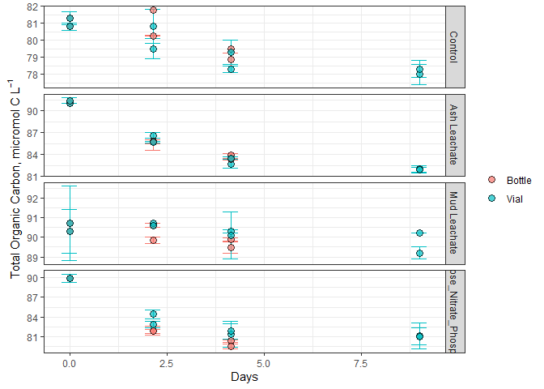
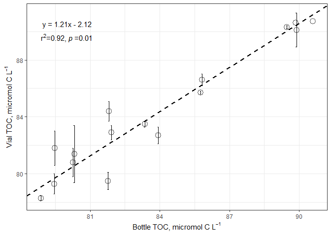
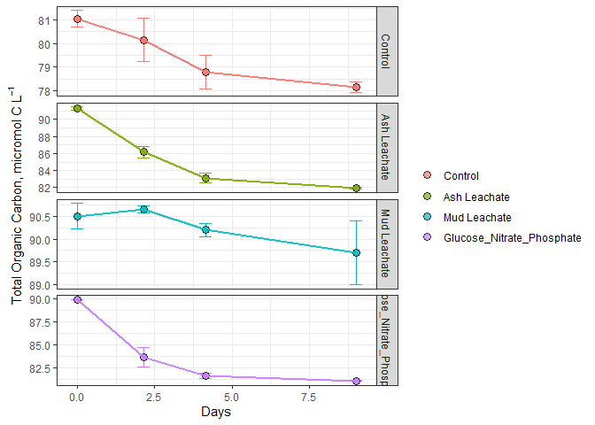
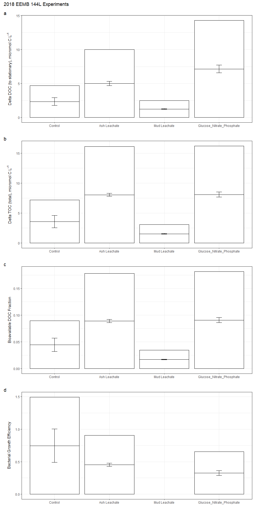

TOC/DOC Analysis Week 4
================
Lexie Christopoulos
11/6/2020

\#Intro

This document shows how **individual bottle** TOC/DOC data from the 2018
remineralization experiments were processed, QD’d, and analyzed.

``` r
library(tidyverse)
```

    ## -- Attaching packages -------------------------------------------- tidyverse 1.3.0 --

    ## v ggplot2 3.3.1     v purrr   0.3.4
    ## v tibble  3.0.0     v dplyr   1.0.0
    ## v tidyr   1.1.0     v stringr 1.4.0
    ## v readr   1.3.1     v forcats 0.5.0

    ## -- Conflicts ----------------------------------------------- tidyverse_conflicts() --
    ## x dplyr::filter() masks stats::filter()
    ## x dplyr::lag()    masks stats::lag()

``` r
library(readxl)
library(lubridate)
```

    ## 
    ## Attaching package: 'lubridate'

    ## The following objects are masked from 'package:base':
    ## 
    ##     date, intersect, setdiff, union

``` r
library(lmodel2)
library(zoo)
```

    ## 
    ## Attaching package: 'zoo'

    ## The following objects are masked from 'package:base':
    ## 
    ##     as.Date, as.Date.numeric

``` r
library(patchwork)
library(praise)
```

\#Import Data

``` r
excel_sheets("C:/Users/aechr/Desktop/github/144l_students/Input_Data/week4/144L_2018_Exp_TOC.xlsx")
```

    ## [1] "Metadata" "Data"

``` r
metadata <- read_excel("C:/Users/aechr/Desktop/github/144l_students/Input_Data/week4/144L_2018_Exp_TOC.xlsx", sheet = "Metadata")

data <- read_excel("C:/Users/aechr/Desktop/github/144l_students/Input_Data/week4/144L_2018_Exp_TOC.xlsx",sheet = "Data")
```

``` r
glimpse(metadata)
```

    ## Rows: 80
    ## Columns: 16
    ## $ Experiment           <chr> "144L_2018", "144L_2018", "144L_2018", "144L_2...
    ## $ Location             <chr> "Campus Point", "Campus Point", "Campus Point"...
    ## $ Temperature          <dbl> 20, 20, 20, 20, 20, 20, 20, 20, 20, 20, 20, 20...
    ## $ Depth                <dbl> 1, 1, 1, 1, 1, 1, 1, 1, 1, 1, 1, 1, 1, 1, 1, 1...
    ## $ Bottle               <chr> "A", "A", "A", "A", "A", "A", "A", "A", "A", "...
    ## $ Timepoint            <dbl> 0, 1, 2, 3, 4, 5, 6, 7, 8, 9, 0, 1, 2, 3, 4, 5...
    ## $ Treatment            <chr> "Control", "Control", "Control", "Control", "C...
    ## $ Target_DOC_Amendment <dbl> 0, 0, 0, 0, 0, 0, 0, 0, 0, 0, 0, 0, 0, 0, 0, 0...
    ## $ Inoculum_L           <dbl> 1.5, 1.5, 1.5, 1.5, 1.5, 1.5, 1.5, 1.5, 1.5, 1...
    ## $ Media_L              <dbl> 3.5, 3.5, 3.5, 3.5, 3.5, 3.5, 3.5, 3.5, 3.5, 3...
    ## $ Datetime             <chr> "2018-10-15T16:30", "2018-10-16T08:00", "2018-...
    ## $ TOC_Sample           <lgl> TRUE, FALSE, FALSE, FALSE, TRUE, FALSE, FALSE,...
    ## $ Parallel_Sample      <lgl> TRUE, FALSE, FALSE, FALSE, TRUE, FALSE, FALSE,...
    ## $ Cell_Sample          <lgl> TRUE, TRUE, TRUE, TRUE, TRUE, TRUE, TRUE, TRUE...
    ## $ DNA_Sample           <lgl> TRUE, FALSE, FALSE, FALSE, TRUE, FALSE, FALSE,...
    ## $ DNA_SampleID         <chr> "144_A0_S6", NA, NA, NA, "144_A4_S7", NA, NA, ...

``` r
glimpse(data)
```

    ## Rows: 32
    ## Columns: 6
    ## $ Bottle    <chr> "A", "A", "A", "A", "B", "B", "B", "B", "C", "C", "C", "C...
    ## $ Timepoint <dbl> 0, 4, 8, 9, 0, 4, 8, 9, 0, 4, 8, 9, 0, 4, 8, 9, 0, 4, 8, ...
    ## $ TOC       <dbl> 81.30000, 81.77997, 78.87473, NA, 80.80000, 80.25890, 79....
    ## $ TOC_sd    <dbl> 0.40000000, NA, 0.38725049, NA, 0.20000000, 0.03069669, N...
    ## $ PTOC      <dbl> 81.3, 79.5, 78.3, 78.0, 80.8, 80.8, 79.3, 78.3, 91.1, 86....
    ## $ PTOC_sd   <dbl> 0.4, 0.6, 0.2, 0.6, 0.2, 1.0, 0.7, 0.5, NA, 0.4, 0.6, 0.5...

\#Prepare Data

``` r
joined <- left_join(metadata, data)
```

    ## Joining, by = c("Bottle", "Timepoint")

``` r
toc <- joined %>% 
  mutate(Datetime = ymd_hm(Datetime)) %>% 
  group_by(Experiment, Bottle) %>%
  mutate(interv = int_length(interval(first(Datetime), Datetime)), hours = interv/3600, days = hours/24) %>%
  ungroup() %>% 
  rename(sd_TOC = TOC_sd, sd_PTOC = PTOC_sd) %>% 
  select(Experiment, Timepoint, Target_DOC_Amendment, Datetime, Bottle, Treatment,TOC:sd_PTOC, hours, days) 

glimpse(toc)
```

    ## Rows: 80
    ## Columns: 12
    ## $ Experiment           <chr> "144L_2018", "144L_2018", "144L_2018", "144L_2...
    ## $ Timepoint            <dbl> 0, 1, 2, 3, 4, 5, 6, 7, 8, 9, 0, 1, 2, 3, 4, 5...
    ## $ Target_DOC_Amendment <dbl> 0, 0, 0, 0, 0, 0, 0, 0, 0, 0, 0, 0, 0, 0, 0, 0...
    ## $ Datetime             <dttm> 2018-10-15 16:30:00, 2018-10-16 08:00:00, 201...
    ## $ Bottle               <chr> "A", "A", "A", "A", "A", "A", "A", "A", "A", "...
    ## $ Treatment            <chr> "Control", "Control", "Control", "Control", "C...
    ## $ TOC                  <dbl> 81.30000, NA, NA, NA, 81.77997, NA, NA, NA, 78...
    ## $ sd_TOC               <dbl> 0.40000000, NA, NA, NA, NA, NA, NA, NA, 0.3872...
    ## $ PTOC                 <dbl> 81.3, NA, NA, NA, 79.5, NA, NA, NA, 78.3, 78.0...
    ## $ sd_PTOC              <dbl> 0.4, NA, NA, NA, 0.6, NA, NA, NA, 0.2, 0.6, 0....
    ## $ hours                <dbl> 0.0, 15.5, 27.5, 39.5, 51.5, 63.5, 75.5, 87.5,...
    ## $ days                 <dbl> 0.0000000, 0.6458333, 1.1458333, 1.6458333, 2....

\#Plot the Curves

\#\#Pivot Data

``` r
pivot_toc <- toc %>% 
  select(Experiment, Bottle, Treatment, days, TOC, PTOC) %>% 
  pivot_longer(TOC:PTOC, names_to = "sample", values_to = "value")

pivot_toc_sd <- toc %>% 
  select(Experiment, Bottle, Treatment, days, sd_TOC, sd_PTOC) %>% 
  pivot_longer(sd_TOC:sd_PTOC, names_to = "sample", names_prefix = "sd_", values_to = "sd")

pivoted <- left_join(pivot_toc, pivot_toc_sd) %>% 
  mutate(sample = ifelse(sample == "TOC", "Bottle", "Vial"))
```

    ## Joining, by = c("Experiment", "Bottle", "Treatment", "days", "sample")

``` r
glimpse(pivoted)
```

    ## Rows: 160
    ## Columns: 7
    ## $ Experiment <chr> "144L_2018", "144L_2018", "144L_2018", "144L_2018", "144...
    ## $ Bottle     <chr> "A", "A", "A", "A", "A", "A", "A", "A", "A", "A", "A", "...
    ## $ Treatment  <chr> "Control", "Control", "Control", "Control", "Control", "...
    ## $ days       <dbl> 0.0000000, 0.0000000, 0.6458333, 0.6458333, 1.1458333, 1...
    ## $ sample     <chr> "Bottle", "Vial", "Bottle", "Vial", "Bottle", "Vial", "B...
    ## $ value      <dbl> 81.30000, 81.30000, NA, NA, NA, NA, NA, NA, 81.77997, 79...
    ## $ sd         <dbl> 0.4000000, 0.4000000, NA, NA, NA, NA, NA, NA, NA, 0.6000...

\#\#Plot

``` r
levels <- c("Control", "Ash Leachate", "Mud Leachate", "Glucose_Nitrate_Phosphate", "Bottle", "Vial")

pivoted %>% 
  drop_na(value) %>% 
  mutate(Treatment = factor(Treatment, levels = levels),
         sample = factor(sample, levels = levels)) %>% 
  ggplot(aes(x = days, y = value, group = interaction(Treatment, Bottle)))+
  geom_errorbar(aes(ymin = value - sd, ymax = value + sd, color = sample), width = 0.4)+
  geom_point(aes(fill = sample), size = 3, shape = 21, alpha = 0.7)+
  labs(x = "Days", y = expression("Total Organic Carbon, micromol C L"^-1), color = "", fill = "")+
  theme_bw()+
  facet_grid(rows = "Treatment", scales = "free")+
  guides(color = FALSE)
```

<!-- -->

The analytical detection limit for our TOC analysis is \~1.5 micromol C
L^-1.

\#TOC vs PTOC (bottle vs vial samples)

``` r
reg.data <- toc %>% 
  drop_na(TOC) %>% 
  filter(Timepoint > 0)

reg <- lmodel2(PTOC ~ TOC, data = reg.data, nperm = 99)
```

    ## RMA was not requested: it will not be computed.

``` r
reg
```

    ## 
    ## Model II regression
    ## 
    ## Call: lmodel2(formula = PTOC ~ TOC, data = reg.data, nperm = 99)
    ## 
    ## n = 16   r = 0.9604998   r-square = 0.9225598 
    ## Parametric P-values:   2-tailed = 3.623619e-09    1-tailed = 1.811809e-09 
    ## Angle between the two OLS regression lines = 2.307491 degrees
    ## 
    ## Permutation tests of OLS, MA, RMA slopes: 1-tailed, tail corresponding to sign
    ## A permutation test of r is equivalent to a permutation test of the OLS slope
    ## P-perm for SMA = NA because the SMA slope cannot be tested
    ## 
    ## Regression results
    ##   Method Intercept     Slope Angle (degrees) P-perm (1-tailed)
    ## 1    OLS  1.291392 0.9890968        44.68594              0.01
    ## 2     MA -2.226082 1.0310159        45.87490              0.01
    ## 3    SMA -2.121795 1.0297731        45.84037                NA
    ## 
    ## Confidence intervals
    ##   Method 2.5%-Intercept 97.5%-Intercept 2.5%-Slope 97.5%-Slope
    ## 1    OLS      -12.50802        15.09081  0.8248319    1.153362
    ## 2     MA      -17.99796        11.05134  0.8727838    1.218975
    ## 3    SMA      -16.99788        10.56939  0.8785273    1.207057
    ## 
    ## Eigenvalues: 34.74849 0.6994871 
    ## 
    ## H statistic used for computing C.I. of MA: 0.006888855

``` r
intercept <- reg$regression.results[3,2]
slope <- reg$regression.results[3,3]

two_int <- reg$confidence.intervals[3,2]
two_slope <- reg$confidence.intervals[3,4]
nine_int <- reg$confidence.intervals[3,3]
nine_slope <- reg$confidence.intervals[3,5]
```

``` r
reg.data %>% 
  ggplot(aes(x = TOC, y = PTOC))+
  geom_errorbar(aes(ymin = PTOC - sd_PTOC, ymax = PTOC + sd_PTOC), width = 0.05)+
  geom_point(shape = 21, size = 4, alpha = 0.7)+
  geom_abline( intercept = intercept, slope = slope, color = "black", linetype = 2, size = 1)+
  geom_abline(intercept = two_int, slope = two_slope, color = "black", linetype = 3, size = 1)+
  geom_abline(intercept = nine_int, slope = nine_slope, color = "black", linetype = 3, size = 1)+
  labs(x = expression("Bottle TOC, micromol C L"^-1), y = expression("Vial TOC, micromol C L"^-1))+
  theme_bw()+
  annotate(geom = "text", label = expression(atop("y = 1.21x - 2.12", paste("r"^2, "=0.92, ", italic("p "), "=0.01"))), x = 80, y = 90, size = 4)
```

    ## Warning in is.na(x): is.na() applied to non-(list or vector) of type
    ## 'expression'

<!-- -->

``` r
bc <- read_rds("C:/Users/aechr/Desktop/github/144l_students/Output_Data/week3/Bacterial_Abundance_Processed_Data.rds")

merge <- left_join(toc, bc) %>% 
  select(Experiment:days, TOC:sd_PTOC, cells:diff_ln_cells, bc, ave_bc, sd_bc, everything(), -c(contains("Sample")) ) %>% 
  group_by(Experiment, Treatment, Bottle) %>% 
  fill(exp_start:sd_lag) %>% 
  ungroup()
```

    ## Joining, by = c("Experiment", "Timepoint", "Datetime", "Bottle", "Treatment", "hours", "days")

``` r
glimpse(merge)
```

    ## Rows: 80
    ## Columns: 39
    ## $ Experiment           <chr> "144L_2018", "144L_2018", "144L_2018", "144L_2...
    ## $ Timepoint            <dbl> 0, 1, 2, 3, 4, 5, 6, 7, 8, 9, 0, 1, 2, 3, 4, 5...
    ## $ Target_DOC_Amendment <dbl> 0, 0, 0, 0, 0, 0, 0, 0, 0, 0, 0, 0, 0, 0, 0, 0...
    ## $ Datetime             <dttm> 2018-10-15 16:30:00, 2018-10-16 08:00:00, 201...
    ## $ Bottle               <chr> "A", "A", "A", "A", "A", "A", "A", "A", "A", "...
    ## $ Treatment            <chr> "Control", "Control", "Control", "Control", "C...
    ## $ TOC                  <dbl> 81.30000, NA, NA, NA, 81.77997, NA, NA, NA, 78...
    ## $ sd_TOC               <dbl> 0.40000000, NA, NA, NA, NA, NA, NA, NA, 0.3872...
    ## $ PTOC                 <dbl> 81.3, NA, NA, NA, 79.5, NA, NA, NA, 78.3, 78.0...
    ## $ sd_PTOC              <dbl> 0.4, NA, NA, NA, 0.6, NA, NA, NA, 0.2, 0.6, 0....
    ## $ hours                <dbl> 0.0, 15.5, 27.5, 39.5, 51.5, 63.5, 75.5, 87.5,...
    ## $ days                 <dbl> 0.0000000, 0.6458333, 1.1458333, 1.6458333, 2....
    ## $ cells                <dbl> 332531522, 523943125, 859019934, 906998856, 93...
    ## $ ln_cells             <dbl> 19.62225, 20.07689, 20.57130, 20.62565, 20.653...
    ## $ diff_ln_cells        <dbl> 0.000000000, 0.454648479, 0.494408990, 0.05434...
    ## $ bc                   <dbl> 0.8313288, 1.3098578, 2.1475498, 2.2674971, 2....
    ## $ ave_bc               <dbl> 0.9022187, 1.3301541, 1.9535757, 2.3515191, 2....
    ## $ sd_bc                <dbl> 0.10025342, 0.02870334, 0.27432087, 0.11882499...
    ## $ Location             <chr> "Campus Point", "Campus Point", "Campus Point"...
    ## $ exp_start            <dbl> 1, 1, 1, 1, 1, 1, 1, 1, 1, 1, 1, 1, 1, 1, 1, 1...
    ## $ exp_end              <dbl> 3, 3, 3, 3, 3, 3, 3, 3, 3, 3, 4, 4, 4, 4, 4, 4...
    ## $ ln_cells_exp_start   <dbl> 20.07689, 20.07689, 20.07689, 20.07689, 20.076...
    ## $ ln_cells_exp_end     <dbl> 20.62565, 20.62565, 20.62565, 20.62565, 20.625...
    ## $ cells_exp_start      <dbl> 523943125, 523943125, 523943125, 523943125, 52...
    ## $ cells_exp_end        <dbl> 906998856, 906998856, 906998856, 906998856, 90...
    ## $ days_exp_start       <dbl> 0.6458333, 0.6458333, 0.6458333, 0.6458333, 0....
    ## $ days_exp_end         <dbl> 1.645833, 1.645833, 1.645833, 1.645833, 1.6458...
    ## $ mew                  <dbl> 0.5487581, 0.5487581, 0.5487581, 0.5487581, 0....
    ## $ doubling             <dbl> 1.263120, 1.263120, 1.263120, 1.263120, 1.2631...
    ## $ delta_cells          <dbl> 574467334, 574467334, 574467334, 574467334, 57...
    ## $ delta_bc             <dbl> 1.436168, 1.436168, 1.436168, 1.436168, 1.4361...
    ## $ ave_mew              <dbl> 0.5134006, 0.5134006, 0.5134006, 0.5134006, 0....
    ## $ sd_mew               <dbl> 0.03638247, 0.03638247, 0.03638247, 0.03638247...
    ## $ ave_doubling         <dbl> 1.356544, 1.356544, 1.356544, 1.356544, 1.3565...
    ## $ sd_doubling          <dbl> 0.09613235, 0.09613235, 0.09613235, 0.09613235...
    ## $ ave_delta_cells      <dbl> 645867748, 645867748, 645867748, 645867748, 64...
    ## $ sd_delta_cells       <dbl> 73470419, 73470419, 73470419, 73470419, 734704...
    ## $ ave_lag              <dbl> 0.6458333, 0.6458333, 0.6458333, 0.6458333, 0....
    ## $ sd_lag               <dbl> 0, 0, 0, 0, 0, 0, 0, 0, 0, 0, 0, 0, 0, 0, 0, 0...

\#Interpolate

We only want to interpolate within an experiment and not across
experiments, so we’ll perform the interpolation by using the
split-apply-combine strategy.

\-split the dataframe into a list of its elements (in this case,
experiment and bottles) -apply the interpolate function to each of the
list elements -combine the results into a new dataframe

\#\#Split

``` r
to_interpolate <- merge %>% 
  select(Experiment, Bottle, Timepoint, days, PTOC, bc) %>% 
  group_by(Experiment, Bottle) #first we'll define the grouping of our dataframe. 

list <- to_interpolate %>% 
  group_split()  #then we convert the dataframe into a list, broken up by the groups (list elements)

keys <- to_interpolate %>% 
  group_keys() %>% 
  mutate(key = paste(Experiment, Bottle))

names(list) <- keys$key
```

\#\#Write the Function

``` r
interp.func <- function(x) {
y <- zoo(x, order.by = x$days) #orders our observations 
interp_toc <- round(as.numeric(na.approx(y$PTOC, na.rm = F)), 1) #interpolates toc 
interp_bc <- round(as.numeric(na.approx(y$bc, na.rm = F)), 1)
z <- cbind(y, interp_toc, interp_bc) #combines the columns 
as_tibble(z) #convets to dataframe 
}
```

\#\#Apply and Combine

``` r
interpolated <- lapply(list, interp.func) %>% 
  plyr::ldply(., as.data.frame) %>% 
  select(-c(.id, PTOC, bc, days)) %>% 
  mutate_at(vars(Timepoint:interp_bc), as.numeric) %>% 
  left_join(merge, .)
```

    ## Joining, by = c("Experiment", "Timepoint", "Bottle")

``` r
glimpse(interpolated)
```

    ## Rows: 80
    ## Columns: 41
    ## $ Experiment           <chr> "144L_2018", "144L_2018", "144L_2018", "144L_2...
    ## $ Timepoint            <dbl> 0, 1, 2, 3, 4, 5, 6, 7, 8, 9, 0, 1, 2, 3, 4, 5...
    ## $ Target_DOC_Amendment <dbl> 0, 0, 0, 0, 0, 0, 0, 0, 0, 0, 0, 0, 0, 0, 0, 0...
    ## $ Datetime             <dttm> 2018-10-15 16:30:00, 2018-10-16 08:00:00, 201...
    ## $ Bottle               <chr> "A", "A", "A", "A", "A", "A", "A", "A", "A", "...
    ## $ Treatment            <chr> "Control", "Control", "Control", "Control", "C...
    ## $ TOC                  <dbl> 81.30000, NA, NA, NA, 81.77997, NA, NA, NA, 78...
    ## $ sd_TOC               <dbl> 0.40000000, NA, NA, NA, NA, NA, NA, NA, 0.3872...
    ## $ PTOC                 <dbl> 81.3, NA, NA, NA, 79.5, NA, NA, NA, 78.3, 78.0...
    ## $ sd_PTOC              <dbl> 0.4, NA, NA, NA, 0.6, NA, NA, NA, 0.2, 0.6, 0....
    ## $ hours                <dbl> 0.0, 15.5, 27.5, 39.5, 51.5, 63.5, 75.5, 87.5,...
    ## $ days                 <dbl> 0.0000000, 0.6458333, 1.1458333, 1.6458333, 2....
    ## $ cells                <dbl> 332531522, 523943125, 859019934, 906998856, 93...
    ## $ ln_cells             <dbl> 19.62225, 20.07689, 20.57130, 20.62565, 20.653...
    ## $ diff_ln_cells        <dbl> 0.000000000, 0.454648479, 0.494408990, 0.05434...
    ## $ bc                   <dbl> 0.8313288, 1.3098578, 2.1475498, 2.2674971, 2....
    ## $ ave_bc               <dbl> 0.9022187, 1.3301541, 1.9535757, 2.3515191, 2....
    ## $ sd_bc                <dbl> 0.10025342, 0.02870334, 0.27432087, 0.11882499...
    ## $ Location             <chr> "Campus Point", "Campus Point", "Campus Point"...
    ## $ exp_start            <dbl> 1, 1, 1, 1, 1, 1, 1, 1, 1, 1, 1, 1, 1, 1, 1, 1...
    ## $ exp_end              <dbl> 3, 3, 3, 3, 3, 3, 3, 3, 3, 3, 4, 4, 4, 4, 4, 4...
    ## $ ln_cells_exp_start   <dbl> 20.07689, 20.07689, 20.07689, 20.07689, 20.076...
    ## $ ln_cells_exp_end     <dbl> 20.62565, 20.62565, 20.62565, 20.62565, 20.625...
    ## $ cells_exp_start      <dbl> 523943125, 523943125, 523943125, 523943125, 52...
    ## $ cells_exp_end        <dbl> 906998856, 906998856, 906998856, 906998856, 90...
    ## $ days_exp_start       <dbl> 0.6458333, 0.6458333, 0.6458333, 0.6458333, 0....
    ## $ days_exp_end         <dbl> 1.645833, 1.645833, 1.645833, 1.645833, 1.6458...
    ## $ mew                  <dbl> 0.5487581, 0.5487581, 0.5487581, 0.5487581, 0....
    ## $ doubling             <dbl> 1.263120, 1.263120, 1.263120, 1.263120, 1.2631...
    ## $ delta_cells          <dbl> 574467334, 574467334, 574467334, 574467334, 57...
    ## $ delta_bc             <dbl> 1.436168, 1.436168, 1.436168, 1.436168, 1.4361...
    ## $ ave_mew              <dbl> 0.5134006, 0.5134006, 0.5134006, 0.5134006, 0....
    ## $ sd_mew               <dbl> 0.03638247, 0.03638247, 0.03638247, 0.03638247...
    ## $ ave_doubling         <dbl> 1.356544, 1.356544, 1.356544, 1.356544, 1.3565...
    ## $ sd_doubling          <dbl> 0.09613235, 0.09613235, 0.09613235, 0.09613235...
    ## $ ave_delta_cells      <dbl> 645867748, 645867748, 645867748, 645867748, 64...
    ## $ sd_delta_cells       <dbl> 73470419, 73470419, 73470419, 73470419, 734704...
    ## $ ave_lag              <dbl> 0.6458333, 0.6458333, 0.6458333, 0.6458333, 0....
    ## $ sd_lag               <dbl> 0, 0, 0, 0, 0, 0, 0, 0, 0, 0, 0, 0, 0, 0, 0, 0...
    ## $ interp_toc           <dbl> 81.3, 80.8, 80.3, 79.9, 79.5, 79.2, 78.9, 78.6...
    ## $ interp_bc            <dbl> 0.8, 1.3, 2.1, 2.3, 2.3, 2.2, 2.0, 2.0, 2.4, N...

\#Estimate DOC, Bioavailibilty and BGEs

``` r
doc <- interpolated %>% 
  mutate(doc = interp_toc - interp_bc) %>% 
  group_by(Experiment, Bottle) %>% 
  mutate(bioav_doc = (first(doc) - last(na.omit(doc))) / first(doc), 
         doc_exp_end = ifelse(Timepoint == exp_end, doc, NA),
         delta_doc = first(doc) - doc_exp_end,
         tdelta_doc = first(doc) - last(na.omit(doc)),
         bge = ifelse(delta_doc > 1.5, delta_bc/delta_doc, NA)) %>% 
  fill(doc_exp_end:bge, .direction = "downup") %>% 
  ungroup()

glimpse(doc)
```

    ## Rows: 80
    ## Columns: 47
    ## $ Experiment           <chr> "144L_2018", "144L_2018", "144L_2018", "144L_2...
    ## $ Timepoint            <dbl> 0, 1, 2, 3, 4, 5, 6, 7, 8, 9, 0, 1, 2, 3, 4, 5...
    ## $ Target_DOC_Amendment <dbl> 0, 0, 0, 0, 0, 0, 0, 0, 0, 0, 0, 0, 0, 0, 0, 0...
    ## $ Datetime             <dttm> 2018-10-15 16:30:00, 2018-10-16 08:00:00, 201...
    ## $ Bottle               <chr> "A", "A", "A", "A", "A", "A", "A", "A", "A", "...
    ## $ Treatment            <chr> "Control", "Control", "Control", "Control", "C...
    ## $ TOC                  <dbl> 81.30000, NA, NA, NA, 81.77997, NA, NA, NA, 78...
    ## $ sd_TOC               <dbl> 0.40000000, NA, NA, NA, NA, NA, NA, NA, 0.3872...
    ## $ PTOC                 <dbl> 81.3, NA, NA, NA, 79.5, NA, NA, NA, 78.3, 78.0...
    ## $ sd_PTOC              <dbl> 0.4, NA, NA, NA, 0.6, NA, NA, NA, 0.2, 0.6, 0....
    ## $ hours                <dbl> 0.0, 15.5, 27.5, 39.5, 51.5, 63.5, 75.5, 87.5,...
    ## $ days                 <dbl> 0.0000000, 0.6458333, 1.1458333, 1.6458333, 2....
    ## $ cells                <dbl> 332531522, 523943125, 859019934, 906998856, 93...
    ## $ ln_cells             <dbl> 19.62225, 20.07689, 20.57130, 20.62565, 20.653...
    ## $ diff_ln_cells        <dbl> 0.000000000, 0.454648479, 0.494408990, 0.05434...
    ## $ bc                   <dbl> 0.8313288, 1.3098578, 2.1475498, 2.2674971, 2....
    ## $ ave_bc               <dbl> 0.9022187, 1.3301541, 1.9535757, 2.3515191, 2....
    ## $ sd_bc                <dbl> 0.10025342, 0.02870334, 0.27432087, 0.11882499...
    ## $ Location             <chr> "Campus Point", "Campus Point", "Campus Point"...
    ## $ exp_start            <dbl> 1, 1, 1, 1, 1, 1, 1, 1, 1, 1, 1, 1, 1, 1, 1, 1...
    ## $ exp_end              <dbl> 3, 3, 3, 3, 3, 3, 3, 3, 3, 3, 4, 4, 4, 4, 4, 4...
    ## $ ln_cells_exp_start   <dbl> 20.07689, 20.07689, 20.07689, 20.07689, 20.076...
    ## $ ln_cells_exp_end     <dbl> 20.62565, 20.62565, 20.62565, 20.62565, 20.625...
    ## $ cells_exp_start      <dbl> 523943125, 523943125, 523943125, 523943125, 52...
    ## $ cells_exp_end        <dbl> 906998856, 906998856, 906998856, 906998856, 90...
    ## $ days_exp_start       <dbl> 0.6458333, 0.6458333, 0.6458333, 0.6458333, 0....
    ## $ days_exp_end         <dbl> 1.645833, 1.645833, 1.645833, 1.645833, 1.6458...
    ## $ mew                  <dbl> 0.5487581, 0.5487581, 0.5487581, 0.5487581, 0....
    ## $ doubling             <dbl> 1.263120, 1.263120, 1.263120, 1.263120, 1.2631...
    ## $ delta_cells          <dbl> 574467334, 574467334, 574467334, 574467334, 57...
    ## $ delta_bc             <dbl> 1.436168, 1.436168, 1.436168, 1.436168, 1.4361...
    ## $ ave_mew              <dbl> 0.5134006, 0.5134006, 0.5134006, 0.5134006, 0....
    ## $ sd_mew               <dbl> 0.03638247, 0.03638247, 0.03638247, 0.03638247...
    ## $ ave_doubling         <dbl> 1.356544, 1.356544, 1.356544, 1.356544, 1.3565...
    ## $ sd_doubling          <dbl> 0.09613235, 0.09613235, 0.09613235, 0.09613235...
    ## $ ave_delta_cells      <dbl> 645867748, 645867748, 645867748, 645867748, 64...
    ## $ sd_delta_cells       <dbl> 73470419, 73470419, 73470419, 73470419, 734704...
    ## $ ave_lag              <dbl> 0.6458333, 0.6458333, 0.6458333, 0.6458333, 0....
    ## $ sd_lag               <dbl> 0, 0, 0, 0, 0, 0, 0, 0, 0, 0, 0, 0, 0, 0, 0, 0...
    ## $ interp_toc           <dbl> 81.3, 80.8, 80.3, 79.9, 79.5, 79.2, 78.9, 78.6...
    ## $ interp_bc            <dbl> 0.8, 1.3, 2.1, 2.3, 2.3, 2.2, 2.0, 2.0, 2.4, N...
    ## $ doc                  <dbl> 80.5, 79.5, 78.2, 77.6, 77.2, 77.0, 76.9, 76.6...
    ## $ bioav_doc            <dbl> 0.05714286, 0.05714286, 0.05714286, 0.05714286...
    ## $ doc_exp_end          <dbl> 77.6, 77.6, 77.6, 77.6, 77.6, 77.6, 77.6, 77.6...
    ## $ delta_doc            <dbl> 2.9, 2.9, 2.9, 2.9, 2.9, 2.9, 2.9, 2.9, 2.9, 2...
    ## $ tdelta_doc           <dbl> 4.6, 4.6, 4.6, 4.6, 4.6, 4.6, 4.6, 4.6, 4.6, 4...
    ## $ bge                  <dbl> 0.4952305, 0.4952305, 0.4952305, 0.4952305, 0....

\#Treatment Averages

``` r
averages <- doc %>% 
  group_by(Experiment, Treatment, Timepoint) %>% 
  mutate(ave_toc = mean(PTOC),
         sd_toc = sd(PTOC)) %>% 
  ungroup() %>%
  group_by(Experiment, Treatment) %>% 
  mutate(ave_bioav_doc = mean(bioav_doc),
         sd_bioav_doc = sd(bioav_doc),
         ave_delta_doc = mean(delta_doc),
         sd_delta_doc = sd(delta_doc),
         ave_tdelta_doc = mean(tdelta_doc),
         sd_tdelta_doc = sd(tdelta_doc),
         ave_bge = mean(bge),
         sd_bge = sd(bge)) %>% 
  ungroup()

#glimpse(averages)
```

\#Plot Treatment Curves (TOC)

``` r
averages %>% 
  mutate(Treatment = factor(Treatment, levels = levels)) %>% 
  drop_na(ave_toc) %>% 
  ggplot(aes(x = days, y = ave_toc, group = interaction(Treatment, Bottle)))+
  geom_errorbar(aes(ymin = ave_toc - sd_toc, ymax = ave_toc + sd_toc, color = Treatment), width = 0.4)+
  geom_point(aes(fill = Treatment), size = 3, shape = 21, alpha = 0.7)+
  geom_line(aes(color = Treatment), size = 1, alpha = 0.7)+
  labs(x = "Days", y = expression("Total Organic Carbon, micromol C L"^-1), color = "", fill = "")+
  theme_bw()+
  facet_grid(rows = "Treatment", scales = "free")+
  guides(color = FALSE)
```

<!-- -->

From these graphs, it looks like all the treatments experianced a
decline in TOC. Ash Leachate and the GNP treatment experianced the
greatest losses and their curves look almost identical (\~ 8 micromoles
each). The Mud Leachate treatment only experianced a decline of about 2
micromoles. It started with about the same level of TOC as the Ash
Leachate and GNP treatments. The control treatment started with far less
TOC than the other treatments, and experianced a decline of about 4
micromoles.

\#Plot Treatment Averages (bars)

``` r
bar.data <- averages %>% 
  select(Treatment, Bottle, ave_bioav_doc:sd_bge) %>% 
  distinct()
```

\#\#\#Bioavaliablity

``` r
bioav <- bar.data %>% 
  ggplot(aes(x = factor(Treatment, levels = levels), y = ave_bioav_doc, group = interaction(Treatment, Bottle)))+
  geom_col(color = "black", fill = "white", alpha = 1)+
  geom_errorbar(aes(ymin = ave_bioav_doc - sd_bioav_doc, ymax = ave_bioav_doc + sd_bioav_doc), width = 0.1, size = 0.5)+
  labs(x = "", y = expression(paste("Bioavailable DOC Fraction")), color = "")+
  theme_bw()
```

\#\#\#Delta DOC

``` r
deldoc <- bar.data %>% 
  ggplot(aes(x = factor(Treatment, levels = levels), y = ave_delta_doc, group = interaction(Treatment, Bottle)))+
  geom_col(color = "black", fill = "white", alpha = 1)+
  geom_errorbar(aes(ymin = ave_delta_doc - sd_delta_doc, ymax = ave_delta_doc + sd_delta_doc), width = 0.1, size = 0.5)+
  labs(x = "", y = expression(paste("Delta DOC (to stationary), micromol C L"^-1)), color = "")+
  theme_bw()
```

\#\#\#Total Delta DOC

``` r
total_deldoc <- bar.data %>% 
  ggplot(aes(x = factor(Treatment, levels = levels), y = ave_tdelta_doc, group = interaction(Treatment, Bottle)))+
  geom_col(color = "black", fill = "white", alpha = 1)+
  geom_errorbar(aes(ymin = ave_tdelta_doc - sd_tdelta_doc, ymax = ave_tdelta_doc + sd_tdelta_doc), width = 0.1, size = 0.5)+
  labs(x = "", y = expression(paste("Delta TOC (total), micromol C L"^-1)), color = "")+
  theme_bw()
```

\#\#\#Bacterial Growth Efficiency

``` r
bge <- bar.data %>% 
  ggplot(aes(x = factor(Treatment, levels = levels), y = ave_bge, group = interaction(Treatment, Bottle)))+
  geom_col(color = "black", fill = "white", alpha = 1)+
  geom_errorbar(aes(ymin = ave_bge - sd_bge, ymax = ave_bge + sd_bge), width = 0.1, size = 0.5)+
  labs(x = "", y = expression(paste("Bacterial Growth Efficiency")), color = "")+
  theme_bw()
```

``` r
deldoc / total_deldoc / bioav / bge + plot_annotation(title = "2018 EEMB 144L Experiments", tag_levels = "a")
```

    ## Warning: Removed 2 rows containing missing values (position_stack).

<!-- -->

As we can see in graph a, the Delta DOC is highest in the GNP treatment,
followed by the Ash Leachate treatment, the control treatment, and the
Mud Leachate treatment. In graph b, which represents total Delta DOC,
the GNP and Ashe Leachate treatments are equal, at just above 15
micromoles. The control treatment is higher than the Mud Leachate
treatment, with around 7 micromoles compared to around 3 micromoles. In
graph c, the GNP treatment displays just a little more bioavailable DOC
than the Ash Leachate treatment, but they are essentially equal. Once
again, the control treatment displays a higher bioavailable DOC than the
mud leachate treatment. Graph d shows the bacterial growth efficiency.
The control had the highest levels of BGE, followed by the Ash Leachate
treatment and the GNP treatment. There appears to be no data for BGE for
the Mud Leachate treatment.

\#Save Data

``` r
saveRDS(averages, "C:/Users/aechr/Desktop/github/144l_students/Output_Data/week4/TOC_DOC_Analysis_Processed_Data.rds")
```
