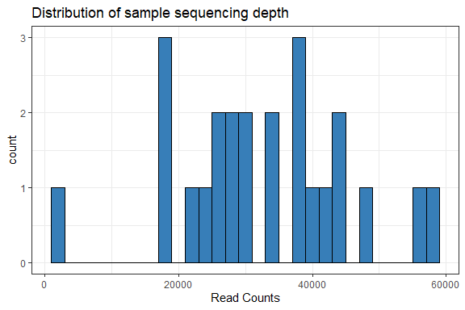
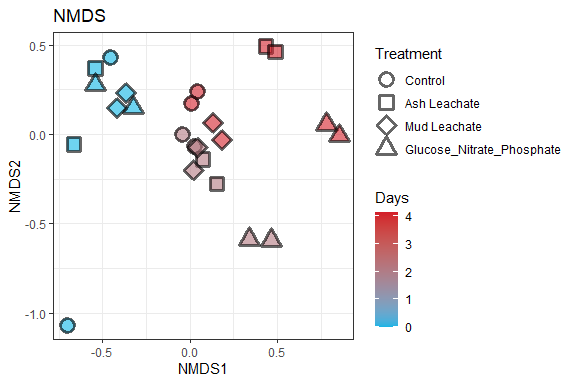
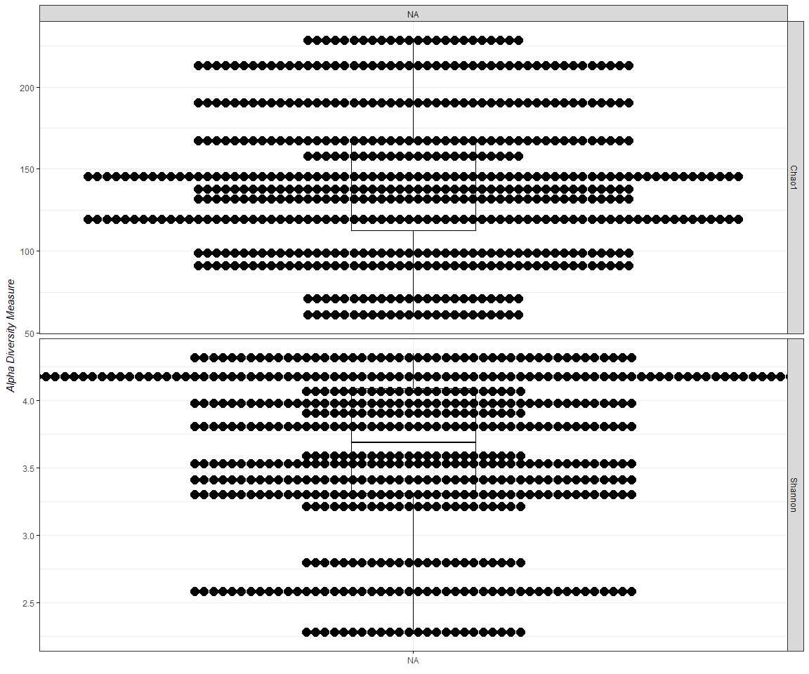
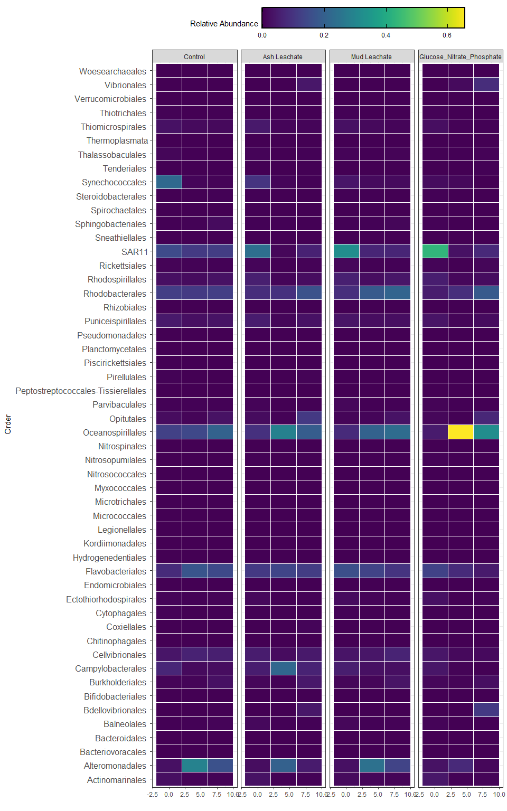

Week 6 Amplicon Code
================
Lexie Christopoulos
11/20/2020

\#Intro

We explore the processed 2018 experimental data sequence using phyloseq.

``` r
library(tidyverse)
library(phyloseq)
library(RColorBrewer)
library(ggpubr)
library(viridis)
```

\#Import Data

``` r
count.tab <- read_rds("C:/Users/aechr/Desktop/github/144l_students/Input_Data/week 6/week5-seqtab-nochimtaxa.rds") #table of counts for each sequence in each sample 

tax.tab <- read_rds("C:/Users/aechr/Desktop/github/144l_students/Input_Data/week 6/week5-taxa.rds") #table that matches ASV to sequence 

sample.tab <- read_rds("C:/Users/aechr/Desktop/github/144l_students/Output_Data/week4/TOC_DOC_Analysis_Processed_Data.rds") %>% 
  drop_na(DNA_SampleID) %>% 
  column_to_rownames(var = "DNA_SampleID")
```

\#Phyloseq Object We need to create a phyloseq object that merges all
three datasets. Sometimes this doesn’t work because of the format of the
data files. Make sure all the sample names between the sampleinfo.txt
and the seqtab-nochimtaxa.txt are the same.

``` r
OTU = otu_table(count.tab, taxa_are_rows = TRUE)
TAX = tax_table(tax.tab)
SAM = sample_data(sample.tab)
ps = phyloseq(OTU,TAX,SAM)
```

\#Filter sequences

We will filter out chloroplasts and mitochondria, because we only
intended to amplify bacterial sequences. It’s good to check you don’t
have anything lurking in the taxonmy table.

``` r
sub_ps <- ps %>% 
  subset_taxa(Family != "mitochondria" & Order != "Cholorplast")
```

\#Sample Summary



``` r
#mean, max, and min of sample read counts 
summary(sample_sum_df)
```

    ##       sum       
    ##  Min.   : 2487  
    ##  1st Qu.:25967  
    ##  Median :32039  
    ##  Mean   :32767  
    ##  3rd Qu.:39763  
    ##  Max.   :58364

\#Beta Diversity

Beta diversity involves calculating metrics such as distances or
dissimilarities based on pairwise comparisons of samples - they do not
exists for a single sample, but rather only as metrics that relate
samples to each other. i.e. beta diversity = patterns in community
structure between samples.

Since differences in sampling depths between samples can influence
distance/dissilimarity metrics, we first need to somehow normalize the
read depth across our samples.

\#\#Subsample

We will rarefy (random subsample with replacement) the read depth of the
samples first (scale to the smallest library size).

Read depth is an artifact of a machine made by a company in San Diego,
not anything about your samples or their biology. It is totally
artifactual, and controlling for artifacts is critical in science.
Subsampling randomly is the simplest way to control for this, and the
question is whether this is the “best” way of controlling for it.

A strong reason to subsample is to standardize effort. The bottom line
is that in all experimental design you should not be comparing things to
which you devote different effort in resolution. For instance, you don’t
sample one site once and week and another once a month if you want to
compare the dynamics between the sites. You standardize effort.

With that said, the bigger your differential in mean (or median) read
depth (reads/sample) between pre-and-post-subsampling, the greater the
“effect” on beta diversity.

Examples: - mean reads before = 40K, mean reads after = 1k, big effect
-mean reads before = 40K, mean reads after = 20k, small effect -mean
reads before = 2k, mean reads after = 1k, small effect

We will subsample to the minimum read depth of all samples and not
subsample. We’ll then compare the mean reads pre-and-post-subsample and
also compare beta diversity patterns.

``` r
ps_min <- rarefy_even_depth(sub_ps, sample.size = min(sample_sums(sub_ps)))
```

    ## You set `rngseed` to FALSE. Make sure you've set & recorded
    ##  the random seed of your session for reproducibility.
    ## See `?set.seed`

    ## ...

    ## 130OTUs were removed because they are no longer 
    ## present in any sample after random subsampling

    ## ...

``` r
#142 OTUs removed 

mean(sample_sums(sub_ps))#32767
```

    ## [1] 32766.96

``` r
mean(sample_sums(ps_min))#2487 same as 
```

    ## [1] 2487

``` r
min(sample_sums(sub_ps))
```

    ## [1] 2487

Based on the mean reads pre and post-subsampling, subsampling here
shouldn’t have a major effect on our beta diversity patterns

## NMDS

One of the best exploratory analyses for amplicon data is unconstrained
ordinations. Here we will look at non-metric multidimensional scaling
(NMDS) ordinations of our full community samples. For NMDS plots it’s
important to set a seed since the starting positions of smaples in the
algorithm is random.

``` r
set.seed(1)
 
nmds <- ordinate(sub_ps, method = "NMDS", distance = "bray") #stress = 0.07
```

    ## Square root transformation
    ## Wisconsin double standardization
    ## Run 0 stress 0.07004614 
    ## Run 1 stress 0.07004612 
    ## ... New best solution
    ## ... Procrustes: rmse 5.579003e-05  max resid 0.0002174433 
    ## ... Similar to previous best
    ## Run 2 stress 0.07004612 
    ## ... New best solution
    ## ... Procrustes: rmse 7.709011e-06  max resid 2.938584e-05 
    ## ... Similar to previous best
    ## Run 3 stress 0.07004612 
    ## ... Procrustes: rmse 6.720736e-06  max resid 1.263862e-05 
    ## ... Similar to previous best
    ## Run 4 stress 0.113252 
    ## Run 5 stress 0.07004612 
    ## ... Procrustes: rmse 7.64802e-06  max resid 2.790176e-05 
    ## ... Similar to previous best
    ## Run 6 stress 0.07944044 
    ## Run 7 stress 0.1493664 
    ## Run 8 stress 0.07004612 
    ## ... Procrustes: rmse 1.606507e-05  max resid 6.187364e-05 
    ## ... Similar to previous best
    ## Run 9 stress 0.1480595 
    ## Run 10 stress 0.1522109 
    ## Run 11 stress 0.1134017 
    ## Run 12 stress 0.07004612 
    ## ... New best solution
    ## ... Procrustes: rmse 1.794801e-06  max resid 5.785827e-06 
    ## ... Similar to previous best
    ## Run 13 stress 0.07004612 
    ## ... Procrustes: rmse 2.238364e-05  max resid 8.707263e-05 
    ## ... Similar to previous best
    ## Run 14 stress 0.0793343 
    ## Run 15 stress 0.07004612 
    ## ... Procrustes: rmse 1.974592e-05  max resid 7.69668e-05 
    ## ... Similar to previous best
    ## Run 16 stress 0.07004612 
    ## ... Procrustes: rmse 5.989053e-06  max resid 2.308092e-05 
    ## ... Similar to previous best
    ## Run 17 stress 0.08024697 
    ## Run 18 stress 0.07004612 
    ## ... Procrustes: rmse 2.018651e-06  max resid 5.403748e-06 
    ## ... Similar to previous best
    ## Run 19 stress 0.07907323 
    ## Run 20 stress 0.07004614 
    ## ... Procrustes: rmse 5.338618e-05  max resid 0.0002080951 
    ## ... Similar to previous best
    ## *** Solution reached

``` r
set.seed(1)

nmds_min <- ordinate(ps_min, method = "NMDS", distance = "bray") #stress = 0.08
```

    ## Square root transformation
    ## Wisconsin double standardization
    ## Run 0 stress 0.07958512 
    ## Run 1 stress 0.1642993 
    ## Run 2 stress 0.07944643 
    ## ... New best solution
    ## ... Procrustes: rmse 0.009864703  max resid 0.03572105 
    ## Run 3 stress 0.07958513 
    ## ... Procrustes: rmse 0.009865873  max resid 0.03568565 
    ## Run 4 stress 0.08009702 
    ## Run 5 stress 0.1498297 
    ## Run 6 stress 0.07977565 
    ## ... Procrustes: rmse 0.02091103  max resid 0.07264437 
    ## Run 7 stress 0.1666407 
    ## Run 8 stress 0.080097 
    ## Run 9 stress 0.1374056 
    ## Run 10 stress 0.1495717 
    ## Run 11 stress 0.1370291 
    ## Run 12 stress 0.07944643 
    ## ... New best solution
    ## ... Procrustes: rmse 6.036959e-06  max resid 2.153643e-05 
    ## ... Similar to previous best
    ## Run 13 stress 0.1381702 
    ## Run 14 stress 0.09346981 
    ## Run 15 stress 0.080097 
    ## Run 16 stress 0.1653062 
    ## Run 17 stress 0.07990394 
    ## ... Procrustes: rmse 0.01007557  max resid 0.03716101 
    ## Run 18 stress 0.07958512 
    ## ... Procrustes: rmse 0.00986425  max resid 0.03567368 
    ## Run 19 stress 0.09346979 
    ## Run 20 stress 0.09278269 
    ## *** Solution reached




NMDS plots attempt to show ordinal distances between samples as
accurately as possible in two dimmensions. It is important to report the
stress of these plots, because a high stress value means that the
algorithms has a hard time representing the distances between samples in
2 dimensions. The stress of this plot was good - it was 0.07 and 0.08
respectively (generally anything below 0.2 is considered acceptable).

Subsampling doesn’t appear to affect the patterens we see in the beta
diversity. So moving forward, we will focus on the subsampled dataset.

\#Alpha Diversity

Estimaing alpha diversity of microbial communities is *problematic* no
matter what you do.

We are going to calculate the Chao1 index for richness and the Shannon
diversity index.

**It is important to note the the alpha diveristy values are not
interpreatable as “real” numbers of anything (due to the nature of
amplicon data), but they can still be useful as relative metrics of
comparison. If Chao1 richness goes up, but Shannon diversity goes down,
it indicates that the sample may have more ASVs but it dominated by a
few of them.**

We will use the subsampled library, which retains estimates of the
species abundance of the real population while standardizing sampling
effort.

Chao1 = nonparametric estimation of minimum community richness

``` r
richness <- estimate_richness(ps_min, measures = c("Chao1", "Shannon")) %>% 
  rownames_to_column(., var = "DNA_SampleID")
```

Let’s add the sample metadata into this dataframe.

``` r
alphadiv <- left_join(richness, sample.tab %>% 
                        rownames_to_column(., var = "DNA_SampleID"))
```

    ## Joining, by = "DNA_SampleID"




I know this data is a mess, but I cannot for the life of me figure out
how to fix it. I’ve tried everything to fix it. The issue is in the
alphadiv table. It shows blanks for all the variables other than the
first 4, and I really don’t know how to fix that. I think if I could fix
that, I could fix these graphs too.

## Generate Relative Abundances

Our data currently shows number gene copies recovered, so we’ll convert
to percentages (relative abundance).

``` r
ps_std <- transform_sample_counts(ps_min, function(x) x/sum(x))
#extract the relative abundance table and coerce into dataframe 
ps_std.tab <- as(otu_table(ps_std), "matrix")
ps_std.df <- as.data.frame(ps_std.tab)
```

\#\#Make Table

``` r
#first coerce the taxa into a data frame 
tax.df <- as.data.frame(tax.tab)
#then combine the data frames 
custom.tab <- tax.df %>% 
  rownames_to_column(., var = "asv") %>% 
  left_join(., ps_std.df %>% rownames_to_column(., var = "asv")) %>%
  #create a new index that combines the class, order, family, and genus values, you can play around here!! 
  mutate(#pcofg = paste(Phylum, "_", Class, "_", Order, "_", Family, "_", Genus), 
    #pcof = paste(Phylum, "_", Class, "_", Order, "_", Family,),
    pco = paste(Phylum, "_", Class, "_", Order, "_")) %>% 
  select(-c(asv:Genus)) %>% 
  select(pco, everything()) %>% 
  group_by(pco) %>% 
  #here we are combining the relative abundances based on our grouping 
  summarise_at(vars(contains(c("144"))), sum, na.rm = TRUE) %>% 
  ungroup()
```

    ## Joining, by = "asv"

``` r
#save the row names and then make them into the column names 
colnames <- custom.tab[,1]

#transpose the dataframe so we can merge with the sample info table 
t_custom.tab <- as.data.frame(t(custom.tab[,-1]))
colnames(t_custom.tab) <- colnames$pco

#merge 
sweet.tab <- t_custom.tab %>% 
  rownames_to_column(., var = "sample") %>% 
  left_join(., sample.tab %>% rownames_to_column(., var = "sample") %>% select(sample, Experiment, Bottle, Treatment, Timepoint, days, cells)) %>% 
  select(sample, Experiment:cells, everything())
```

    ## Joining, by = "sample"

``` r
relabund <- sweet.tab %>% 
  select(-c(sample:cells)) %>% 
  #remove groups that are completely absent 
  .[ , colSums(.) > 0] %>% 
  #arrange by biggest contributors 
  .[, order(colSums(-.))] %>% 
  bind_cols(sweet.tab %>% select(sample:cells), .)
```

\#Heatmap



\#Save and knit

``` r
saveRDS(sweet.tab, "C:/Users/aechr/Desktop/github/144l_students/Output_Data/week6/Week6_Custom_ASV_Table.rds")
saveRDS(sub_ps, "C:/Users/aechr/Desktop/github/144l_students/Output_Data/week6/Week6_phyloseq_obj.rds")
saveRDS(ps_min, "C:/Users/aechr/Desktop/github/144l_students/Output_Data/week6/Week6_subsampled_phyloseq_obj.rds")
saveRDS(alphadiv, "C:/Users/aechr/Desktop/github/144l_students/Output_Data/week6/Week6_alphadiv.rds")
```
