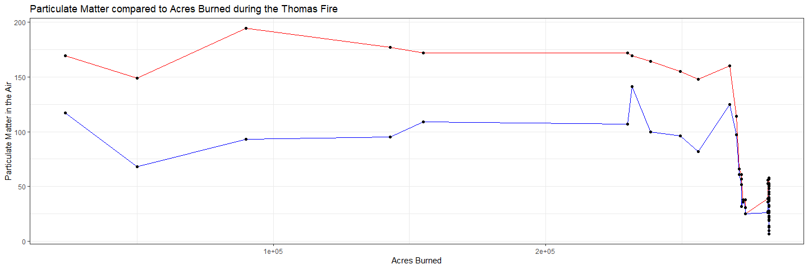
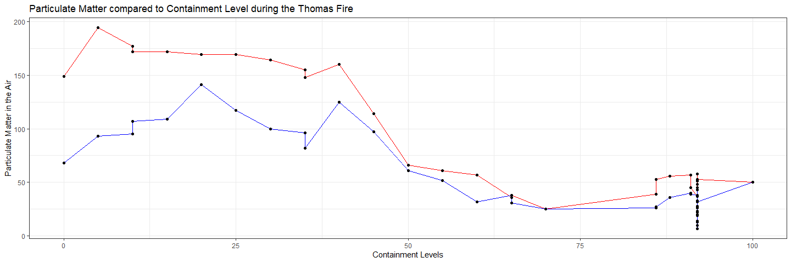

Thomas Fire Analysis
================
Lexie Christopoulos
10/23/2020

# Load Libraries

``` r
library(tidyverse)
library(readxl)
library(RColorBrewer)
library(ggplot2)
library(dplyr)
library(praise)
```

\#Load Data

``` r
excel_sheets("C:/Users/aechr/Desktop/github/144l_students/Input_Data/week1/Thomas_Fire_Progression.xlsx" )
```

    ## [1] "Data"     "Metadata"

``` r
Thomas.Fire.data <- read_excel("C:/Users/aechr/Desktop/github/144l_students/Input_Data/week1/Thomas_Fire_Progression.xlsx")
glimpse(Thomas.Fire.data)
```

    ## Rows: 39
    ## Columns: 5
    ## $ Date         <dttm> 2017-12-05, 2017-12-06, 2017-12-07, 2017-12-08, 2017-...
    ## $ Acres_Burned <dbl> 50000, 90000, 115000, 143000, 155000, 230000, 231700, ...
    ## $ Containment  <dbl> 0, 5, 5, 10, 15, 10, 20, 25, 30, 35, 35, 40, 45, 50, 5...
    ## $ PM10         <dbl> 68, 93, NA, 95, 109, 107, 141, 117, 100, 96, 82, 125, ...
    ## $ PM25         <dbl> 149, 194, 281, 177, 172, 172, 169, 169, 164, 155, 148,...

``` r
view(Thomas.Fire.data)
```

\#Plot Data

``` r
plot.1.data <- Thomas.Fire.data %>%
  drop_na("PM10") %>% 
  rename(acres= Acres_Burned, PM2.5 = PM25) %>% 
  select(acres,PM10:PM2.5) 
```

``` r
plot.2.data <- Thomas.Fire.data %>% 
  rename(containment = Containment, PM2.5 = PM25) %>% 
  select(containment:PM2.5) %>% 
  drop_na("PM10")
```

\#Plotting Data

I want to make two plots. The first one will compare the number of acres
burned to the levels of PM2.5 and PM10.

``` r
ggplot(plot.1.data, aes(x=acres))+
  geom_line(aes(y=PM2.5), color="red")+
  geom_line(aes(y=PM10), color="blue")+
  geom_point(aes(y=PM2.5))+
  geom_point(aes(y=PM10))+
  labs(x= "Acres Burned", y = "Particulate Matter in the Air", title = "Particulate Matter compared to Acres Burned during the Thomas Fire")+
  theme_bw()
```

<!-- -->

In this graph, the PM2.5 is depicted in red and the PM10 is depicted in
blue. My initial prediciton and expectations would have been that as
more acres burned, the levels of PM2.5 and PM10 would also increase. We
can see that the levels of particulate matter follow roughly the same
pattern, with PM2.5 being at a higher concentration than PM10. We also
see that both concentrations are at a steady level, untill we get to
large numbers of acres burned, when both PM2.5 and PM10 concentrations
sharply decline. From this graph alone, it is unclear why this happens,
but it can indicate that an increase in the acres burned during the
Thomas Fire did not result in an increase in the levels of PM2.5 and
PM10 in the air.

This next plot will compare the levels of containment of the Thomas Fire
and the PM2.5 and PM10 Concentrations.

``` r
ggplot(plot.2.data, aes(x=containment))+
  geom_line(aes(y=PM2.5), color="red")+
  geom_line(aes(y=PM10), color="blue")+
  geom_point(aes(y=PM2.5))+
  geom_point(aes(y=PM10))+
  labs(x= "Containment Levels", y = "Particulate Matter in the Air", title = "Particulate Matter compared to Containment Level during the Thomas Fire")+
  theme_bw()
```

<!-- -->

In this plot, as in the one above, the PM2.5 levels are indicated by the
red line, and the PM10 levels are indicated by the blue line. My initial
predictions and expection would have been that as containment levels
increase, PM2.5 and PM10 concentrations would decrease. As we can see,
the highest levels of particulate matter are present when there is 0 to
25 % containment. At around 40% containment, we see a steep decline in
particulate matter concentration, and continues to decline until it
levels out at around 75% containment. It appears that as containment
levels increase, PM2.5 and PM10 concentrations decrease. This could be
an explination for the patterns seen in the graph above; more acres
would burn, even as containment levels increase. That could be another
plot done to better interpret this data. Statistical tests and analyses
would need to be performed in order to reach any real conclusions, but
based on these graphs alone, it would appear that fire containment
levels during the Thomas Fire are a better indicator of the
concentrations of PM2.5 and PM10 than the numbers of acres burned, and
that these two parameters might actually follow each other closer than
expected.
